## Group imb_IRhigherThan9p1

### ecoli-0-1-3-7_vs_2-6 dataset

Best parameters
>	{'a_steps': 1, 'approach': 'brute', 'focus': 3, 'fuser': 'equal', 'grain': 8}

|CLF|ACC|STD|
|---|---|---|
| EEC | 0.989 | +-0.01|
| DTC | 0.965 | +-0.02|
| kNN | 0.993 | +-0.01|
| SVC | 0.975 | +-0.01|
| NBC | 0.943 | +-0.03|
| MLP | 0.982 | +-0.01|

\emph{ecoli-0-1-3-7-vs-2-6} & brute & equal & 8 & 3.0 & 1 & \cellcolor{green!25} 0.989 & \cellcolor{green!25} 0.965 & \cellcolor{green!25} 0.993 & \cellcolor{green!25} 0.975 & \cellcolor{green!25} 0.943 & \cellcolor{green!25} 0.982\\

### ecoli4 dataset

Best parameters
>	{'a_steps': 1, 'approach': 'brute', 'focus': 4, 'fuser': 'theta', 'grain': 16}

|CLF|ACC|STD|
|---|---|---|
| EEC | 0.979 | +-0.02|
| DTC | 0.958 | +-0.01|
| kNN | 0.979 | +-0.02|
| SVC | 0.940 | +-0.00|
| NBC | 0.815 | +-0.13|
| MLP | 0.940 | +-0.00|

\emph{ecoli4} & brute & theta & 16 & 4.0 & 1 & \cellcolor{green!25} 0.979 & \cellcolor{green!25} 0.958 & \cellcolor{green!25} 0.979 & 0.940 & 0.815 & 0.940\\

### glass-0-1-6_vs_2 dataset

Best parameters
>	{'a_steps': 1, 'approach': 'brute', 'focus': 1, 'fuser': 'equal', 'grain': 32}

|CLF|ACC|STD|
|---|---|---|
| EEC | 0.828 | +-0.05|
| DTC | 0.828 | +-0.04|
| kNN | 0.901 | +-0.02|
| SVC | 0.912 | +-0.01|
| NBC | 0.427 | +-0.06|
| MLP | 0.906 | +-0.01|

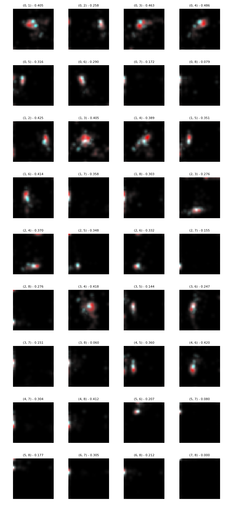
\emph{glass-0-1-6-vs-2} & brute & equal & 32 & 1.0 & 1 & \cellcolor{green!25} 0.828 & \cellcolor{green!25} 0.828 & \cellcolor{green!25} 0.901 & \cellcolor{green!25} 0.912 & 0.427 & \cellcolor{green!25} 0.906\\

### glass-0-1-6_vs_5 dataset

Best parameters
>	{'a_steps': 1, 'approach': 'purified', 'focus': 4, 'fuser': 'equal', 'grain': 8}

|CLF|ACC|STD|
|---|---|---|
| EEC | 0.897 | +-0.06|
| DTC | 0.957 | +-0.04|
| kNN | 0.951 | +-0.03|
| SVC | 0.951 | +-0.01|
| NBC | 0.978 | +-0.01|
| MLP | 0.951 | +-0.01|

\emph{glass-0-1-6-vs-5} & purified & equal & 8 & 4.0 & 1 & \cellcolor{blue!25} 0.897 & \cellcolor{blue!25} 0.957 & \cellcolor{blue!25} 0.951 & \cellcolor{blue!25} 0.951 & 0.978 & \cellcolor{blue!25} 0.951\\

### glass2 dataset

Best parameters
>	{'a_steps': 2, 'approach': 'purified', 'focus': 4, 'fuser': 'theta', 'grain': 8}

|CLF|ACC|STD|
|---|---|---|
| EEC | 0.832 | +-0.04|
| DTC | 0.864 | +-0.07|
| kNN | 0.892 | +-0.02|
| SVC | 0.921 | +-0.01|
| NBC | 0.457 | +-0.06|
| MLP | 0.921 | +-0.01|

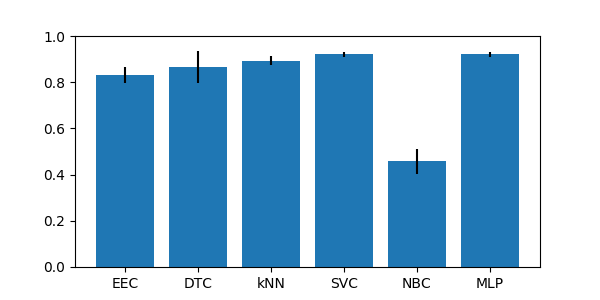

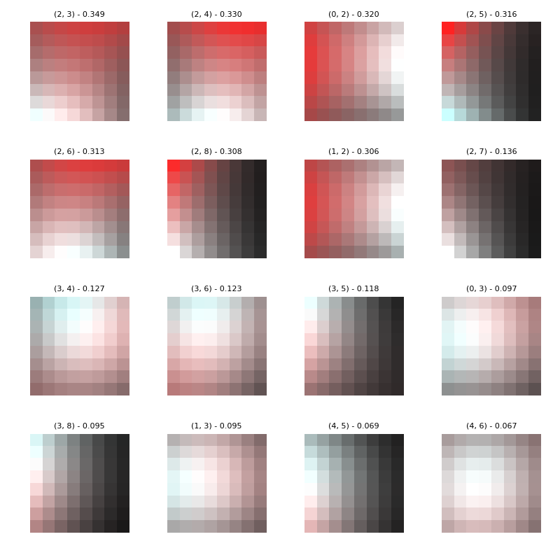
\emph{glass2} & purified & theta & 8 & 4.0 & 2 & \cellcolor{blue!25} 0.832 & \cellcolor{blue!25} 0.864 & 0.892 & 0.921 & 0.457 & 0.921\\

### glass4 dataset

Best parameters
>	{'a_steps': 1, 'approach': 'brute', 'focus': 4, 'fuser': 'equal', 'grain': 32}

|CLF|ACC|STD|
|---|---|---|
| EEC | 0.958 | +-0.03|
| DTC | 0.949 | +-0.04|
| kNN | 0.967 | +-0.02|
| SVC | 0.958 | +-0.02|
| NBC | 0.897 | +-0.04|
| MLP | 0.939 | +-0.01|

\emph{glass4} & brute & equal & 32 & 4.0 & 1 & \cellcolor{green!25} 0.958 & \cellcolor{green!25} 0.949 & \cellcolor{green!25} 0.967 & \cellcolor{green!25} 0.958 & \cellcolor{green!25} 0.897 & \cellcolor{green!25} 0.939\\

### glass5 dataset

Best parameters
>	{'a_steps': 1, 'approach': 'purified', 'focus': 4, 'fuser': 'equal', 'grain': 8}

|CLF|ACC|STD|
|---|---|---|
| EEC | 0.916 | +-0.07|
| DTC | 0.991 | +-0.01|
| kNN | 0.963 | +-0.02|
| SVC | 0.958 | +-0.01|
| NBC | 0.972 | +-0.03|
| MLP | 0.958 | +-0.01|

\emph{glass5} & purified & equal & 8 & 4.0 & 1 & \cellcolor{blue!25} 0.916 & 0.991 & \cellcolor{blue!25} 0.963 & \cellcolor{blue!25} 0.958 & 0.972 & \cellcolor{blue!25} 0.958\\

### page-blocks-1-3_vs_4 dataset

Best parameters
>	{'a_steps': 1, 'approach': 'random', 'focus': 1, 'fuser': 'equal', 'grain': 32}

|CLF|ACC|STD|
|---|---|---|
| EEC | 0.858 | +-0.05|
| DTC | 0.992 | +-0.01|
| kNN | 0.955 | +-0.03|
| SVC | 0.941 | +-0.00|
| NBC | 0.930 | +-0.02|
| MLP | 0.799 | +-0.15|

\emph{page-blocks-1-3-vs-4} & random & equal & 32 & 1.0 & 1 & \cellcolor{blue!25} 0.858 & 0.992 & \cellcolor{blue!25} 0.955 & \cellcolor{blue!25} 0.941 & \cellcolor{blue!25} 0.930 & \cellcolor{blue!25} 0.799\\

### shuttle-c0-vs-c4 dataset

Best parameters
>	{'a_steps': 1, 'approach': 'brute', 'focus': 1, 'fuser': 'equal', 'grain': 8}

|CLF|ACC|STD|
|---|---|---|
| EEC | 1.000 | +-0.00|
| DTC | 1.000 | +-0.00|
| kNN | 0.999 | +-0.00|
| SVC | 0.940 | +-0.00|
| NBC | 0.997 | +-0.00|
| MLP | 0.998 | +-0.00|

\emph{shuttle-c0-vs-c4} & brute & equal & 8 & 1.0 & 1 & \cellcolor{blue!25} 1.000 & 1.000 & \cellcolor{blue!25} 0.999 & 0.940 & \cellcolor{blue!25} 0.997 & \cellcolor{blue!25} 0.998\\

### shuttle-c2-vs-c4 dataset

Best parameters
>	{'a_steps': 1, 'approach': 'brute', 'focus': 1, 'fuser': 'equal', 'grain': 8}

|CLF|ACC|STD|
|---|---|---|
| EEC | 1.000 | +-0.00|
| DTC | 1.000 | +-0.00|
| kNN | 0.961 | +-0.02|
| SVC | 0.954 | +-0.02|
| NBC | 0.992 | +-0.02|
| MLP | 0.961 | +-0.02|

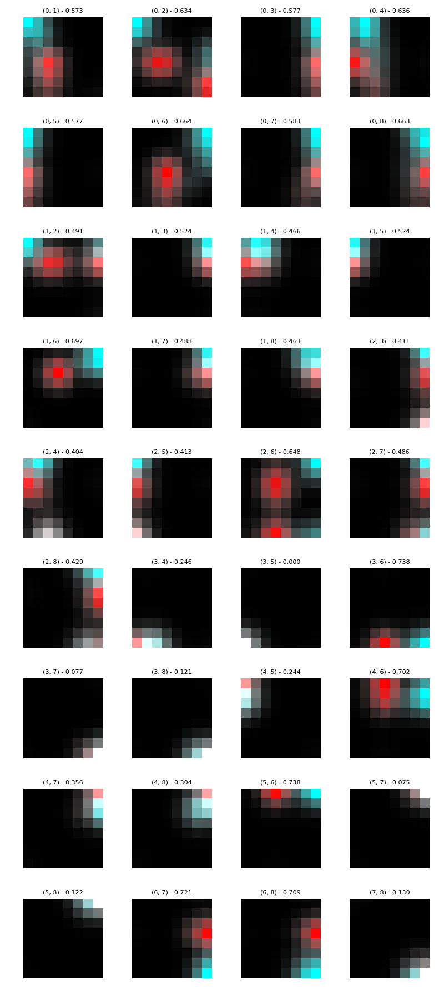
\emph{shuttle-c2-vs-c4} & brute & equal & 8 & 1.0 & 1 & \cellcolor{blue!25} 1.000 & 1.000 & \cellcolor{blue!25} 0.961 & 0.954 & \cellcolor{blue!25} 0.992 & \cellcolor{blue!25} 0.961\\

### vowel0 dataset

Best parameters
>	{'a_steps': 4, 'approach': 'purified', 'focus': 3, 'fuser': 'theta', 'grain': 8}

|CLF|ACC|STD|
|---|---|---|
| EEC | 0.963 | +-0.01|
| DTC | 0.982 | +-0.01|
| kNN | 0.995 | +-0.00|
| SVC | 0.997 | +-0.01|
| NBC | 0.939 | +-0.02|
| MLP | 0.997 | +-0.00|

\emph{vowel0} & purified & theta & 8 & 3.0 & 4 & \cellcolor{blue!25} 0.963 & 0.982 & 0.995 & 0.997 & 0.939 & 0.997\\

### yeast-0-5-6-7-9_vs_4 dataset

Best parameters
>	{'a_steps': 1, 'approach': 'purified', 'focus': 4, 'fuser': 'equal', 'grain': 8}

|CLF|ACC|STD|
|---|---|---|
| EEC | 0.898 | +-0.03|
| DTC | 0.860 | +-0.04|
| kNN | 0.917 | +-0.01|
| SVC | 0.903 | +-0.00|
| NBC | 0.134 | +-0.03|
| MLP | 0.905 | +-0.01|

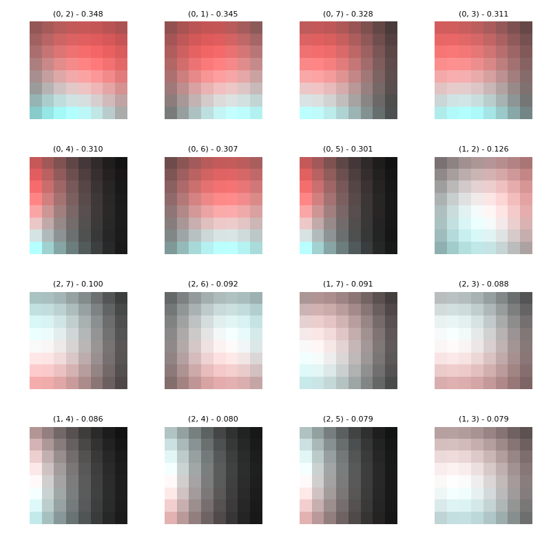
\emph{yeast-0-5-6-7-9-vs-4} & purified & equal & 8 & 4.0 & 1 & \cellcolor{green!25} 0.898 & \cellcolor{green!25} 0.860 & \cellcolor{green!25} 0.917 & \cellcolor{green!25} 0.903 & 0.134 & \cellcolor{green!25} 0.905\\

### yeast-1-2-8-9_vs_7 dataset

Best parameters
>	{'a_steps': 4, 'approach': 'random', 'focus': 4, 'fuser': 'theta', 'grain': 8}

|CLF|ACC|STD|
|---|---|---|
| EEC | 0.967 | +-0.01|
| DTC | 0.942 | +-0.01|
| kNN | 0.967 | +-0.00|
| SVC | 0.968 | +-0.00|
| NBC | 0.117 | +-0.05|
| MLP | 0.968 | +-0.00|

\emph{yeast-1-2-8-9-vs-7} & random & theta & 8 & 4.0 & 4 & \cellcolor{green!25} 0.967 & 0.942 & \cellcolor{green!25} 0.967 & \cellcolor{green!25} 0.968 & 0.117 & \cellcolor{green!25} 0.968\\

### yeast-1-4-5-8_vs_7 dataset

Best parameters
>	{'a_steps': 4, 'approach': 'brute', 'focus': 4, 'fuser': 'equal', 'grain': 8}

|CLF|ACC|STD|
|---|---|---|
| EEC | 0.935 | +-0.04|
| DTC | 0.915 | +-0.03|
| kNN | 0.955 | +-0.00|
| SVC | 0.957 | +-0.00|
| NBC | 0.133 | +-0.05|
| MLP | 0.957 | +-0.00|

\emph{yeast-1-4-5-8-vs-7} & brute & equal & 8 & 4.0 & 4 & \cellcolor{green!25} 0.935 & \cellcolor{green!25} 0.915 & \cellcolor{green!25} 0.955 & \cellcolor{green!25} 0.957 & 0.133 & \cellcolor{green!25} 0.957\\

### yeast-1_vs_7 dataset

Best parameters
>	{'a_steps': 1, 'approach': 'brute', 'focus': 1, 'fuser': 'equal', 'grain': 32}

|CLF|ACC|STD|
|---|---|---|
| EEC | 0.902 | +-0.02|
| DTC | 0.893 | +-0.01|
| kNN | 0.937 | +-0.00|
| SVC | 0.935 | +-0.00|
| NBC | 0.259 | +-0.04|
| MLP | 0.935 | +-0.00|

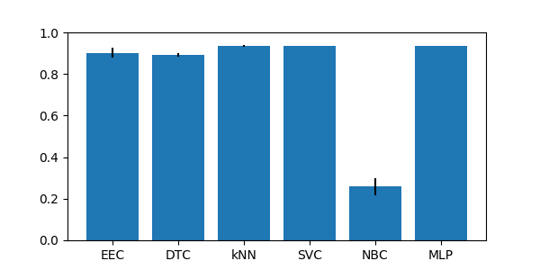

\emph{yeast-1-vs-7} & brute & equal & 32 & 1.0 & 1 & \cellcolor{green!25} 0.902 & \cellcolor{green!25} 0.893 & \cellcolor{green!25} 0.937 & \cellcolor{green!25} 0.935 & 0.259 & \cellcolor{green!25} 0.935\\

### yeast-2_vs_4 dataset

Best parameters
>	{'a_steps': 3, 'approach': 'brute', 'focus': 3, 'fuser': 'equal', 'grain': 8}

|CLF|ACC|STD|
|---|---|---|
| EEC | 0.955 | +-0.01|
| DTC | 0.944 | +-0.01|
| kNN | 0.959 | +-0.01|
| SVC | 0.901 | +-0.00|
| NBC | 0.239 | +-0.04|
| MLP | 0.909 | +-0.01|

\emph{yeast-2-vs-4} & brute & equal & 8 & 3.0 & 3 & \cellcolor{green!25} 0.955 & \cellcolor{green!25} 0.944 & \cellcolor{green!25} 0.959 & 0.901 & 0.239 & 0.909\\

### yeast-2_vs_8 dataset

Best parameters
>	{'a_steps': 4, 'approach': 'brute', 'focus': 4, 'fuser': 'equal', 'grain': 8}

|CLF|ACC|STD|
|---|---|---|
| EEC | 0.963 | +-0.01|
| DTC | 0.956 | +-0.01|
| kNN | 0.979 | +-0.01|
| SVC | 0.977 | +-0.00|
| NBC | 0.389 | +-0.30|
| MLP | 0.977 | +-0.00|

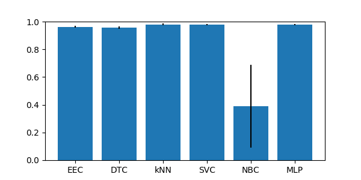

\emph{yeast-2-vs-8} & brute & equal & 8 & 4.0 & 4 & \cellcolor{blue!25} 0.963 & \cellcolor{blue!25} 0.956 & 0.979 & 0.977 & \cellcolor{blue!25} 0.389 & 0.977\\

### yeast4 dataset

Best parameters
>	{'a_steps': 4, 'approach': 'brute', 'focus': 4, 'fuser': 'equal', 'grain': 8}

|CLF|ACC|STD|
|---|---|---|
| EEC | 0.952 | +-0.02|
| DTC | 0.952 | +-0.01|
| kNN | 0.965 | +-0.00|
| SVC | 0.966 | +-0.00|
| NBC | 0.168 | +-0.05|
| MLP | 0.966 | +-0.00|

\emph{yeast4} & brute & equal & 8 & 4.0 & 4 & \cellcolor{green!25} 0.952 & \cellcolor{green!25} 0.952 & \cellcolor{green!25} 0.965 & \cellcolor{green!25} 0.966 & 0.168 & \cellcolor{green!25} 0.966\\

### yeast5 dataset

Best parameters
>	{'a_steps': 2, 'approach': 'random', 'focus': 4, 'fuser': 'equal', 'grain': 8}

|CLF|ACC|STD|
|---|---|---|
| EEC | 0.975 | +-0.01|
| DTC | 0.983 | +-0.00|
| kNN | 0.985 | +-0.01|
| SVC | 0.970 | +-0.00|
| NBC | 0.671 | +-0.04|
| MLP | 0.974 | +-0.00|

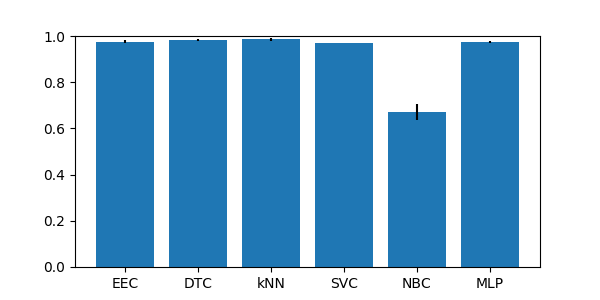

\emph{yeast5} & random & equal & 8 & 4.0 & 2 & \cellcolor{green!25} 0.975 & \cellcolor{green!25} 0.983 & \cellcolor{green!25} 0.985 & \cellcolor{green!25} 0.970 & 0.671 & \cellcolor{green!25} 0.974\\

### yeast6 dataset

Best parameters
>	{'a_steps': 4, 'approach': 'brute', 'focus': 4, 'fuser': 'equal', 'grain': 8}

|CLF|ACC|STD|
|---|---|---|
| EEC | 0.957 | +-0.01|
| DTC | 0.966 | +-0.01|
| kNN | 0.980 | +-0.01|
| SVC | 0.976 | +-0.00|
| NBC | 0.316 | +-0.07|
| MLP | 0.976 | +-0.00|

\emph{yeast6} & brute & equal & 8 & 4.0 & 4 & \cellcolor{blue!25} 0.957 & 0.966 & 0.980 & 0.976 & 0.316 & 0.976\\

## Group imb_IRhigherThan9p2

### ecoli-0-1-4-6_vs_5 dataset

Best parameters
>	{'a_steps': 1, 'approach': 'random', 'focus': 4, 'fuser': 'equal', 'grain': 16}

|CLF|ACC|STD|
|---|---|---|
| EEC | 0.975 | +-0.02|
| DTC | 0.929 | +-0.03|
| kNN | 0.982 | +-0.01|
| SVC | 0.929 | +-0.00|
| NBC | 0.943 | +-0.05|
| MLP | 0.932 | +-0.02|

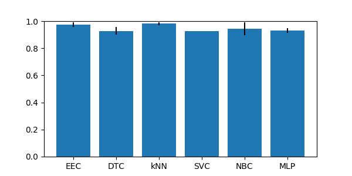

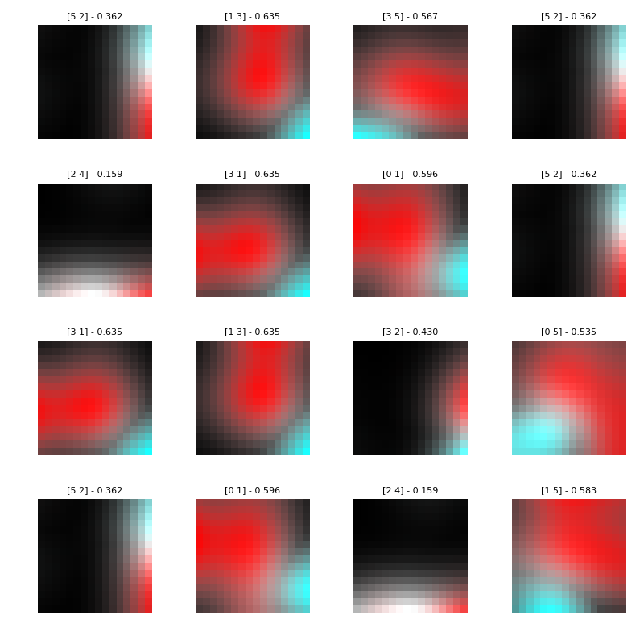
\emph{ecoli-0-1-4-6-vs-5} & random & equal & 16 & 4.0 & 1 & \cellcolor{green!25} 0.975 & 0.929 & \cellcolor{green!25} 0.982 & 0.929 & \cellcolor{green!25} 0.943 & \cellcolor{green!25} 0.932\\

### ecoli-0-1-4-7_vs_2-3-5-6 dataset

Best parameters
>	{'a_steps': 3, 'approach': 'purified', 'focus': 3, 'fuser': 'equal', 'grain': 8}

|CLF|ACC|STD|
|---|---|---|
| EEC | 0.944 | +-0.02|
| DTC | 0.944 | +-0.02|
| kNN | 0.973 | +-0.01|
| SVC | 0.914 | +-0.01|
| NBC | 0.932 | +-0.01|
| MLP | 0.929 | +-0.02|

\emph{ecoli-0-1-4-7-vs-2-3-5-6} & purified & equal & 8 & 3.0 & 3 & \cellcolor{green!25} 0.944 & \cellcolor{green!25} 0.944 & \cellcolor{green!25} 0.973 & 0.914 & \cellcolor{green!25} 0.932 & \cellcolor{green!25} 0.929\\

### ecoli-0-1-4-7_vs_5-6 dataset

Best parameters
>	{'a_steps': 3, 'approach': 'random', 'focus': 3, 'fuser': 'theta', 'grain': 8}

|CLF|ACC|STD|
|---|---|---|
| EEC | 0.958 | +-0.02|
| DTC | 0.952 | +-0.01|
| kNN | 0.973 | +-0.02|
| SVC | 0.925 | +-0.00|
| NBC | 0.952 | +-0.03|
| MLP | 0.949 | +-0.04|

\emph{ecoli-0-1-4-7-vs-5-6} & random & theta & 8 & 3.0 & 3 & \cellcolor{green!25} 0.958 & \cellcolor{green!25} 0.952 & \cellcolor{green!25} 0.973 & 0.925 & \cellcolor{green!25} 0.952 & \cellcolor{green!25} 0.949\\

### ecoli-0-1_vs_2-3-5 dataset

Best parameters
>	{'a_steps': 2, 'approach': 'purified', 'focus': 4, 'fuser': 'equal', 'grain': 16}

|CLF|ACC|STD|
|---|---|---|
| EEC | 0.963 | +-0.02|
| DTC | 0.918 | +-0.02|
| kNN | 0.967 | +-0.01|
| SVC | 0.902 | +-0.01|
| NBC | 0.926 | +-0.04|
| MLP | 0.955 | +-0.03|

\emph{ecoli-0-1-vs-2-3-5} & purified & equal & 16 & 4.0 & 2 & \cellcolor{green!25} 0.963 & 0.918 & \cellcolor{green!25} 0.967 & 0.902 & \cellcolor{green!25} 0.926 & \cellcolor{green!25} 0.955\\

### ecoli-0-1_vs_5 dataset

Best parameters
>	{'a_steps': 4, 'approach': 'random', 'focus': 4, 'fuser': 'equal', 'grain': 16}

|CLF|ACC|STD|
|---|---|---|
| EEC | 0.979 | +-0.01|
| DTC | 0.958 | +-0.03|
| kNN | 0.983 | +-0.02|
| SVC | 0.917 | +-0.00|
| NBC | 0.933 | +-0.06|
| MLP | 0.908 | +-0.02|

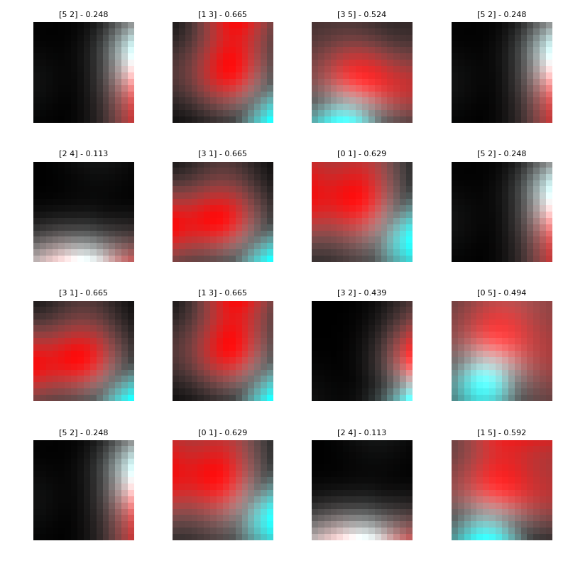
\emph{ecoli-0-1-vs-5} & random & equal & 16 & 4.0 & 4 & \cellcolor{green!25} 0.979 & \cellcolor{green!25} 0.958 & \cellcolor{green!25} 0.983 & 0.917 & \cellcolor{green!25} 0.933 & 0.908\\

### ecoli-0-2-3-4_vs_5 dataset

Best parameters
>	{'a_steps': 1, 'approach': 'purified', 'focus': 3, 'fuser': 'equal', 'grain': 8}

|CLF|ACC|STD|
|---|---|---|
| EEC | 0.950 | +-0.02|
| DTC | 0.946 | +-0.02|
| kNN | 0.970 | +-0.04|
| SVC | 0.901 | +-0.00|
| NBC | 0.677 | +-0.15|
| MLP | 0.891 | +-0.02|

\emph{ecoli-0-2-3-4-vs-5} & purified & equal & 8 & 3.0 & 1 & \cellcolor{green!25} 0.950 & \cellcolor{green!25} 0.946 & \cellcolor{green!25} 0.970 & 0.901 & 0.677 & 0.891\\

### ecoli-0-2-6-7_vs_3-5 dataset

Best parameters
>	{'a_steps': 1, 'approach': 'purified', 'focus': 4, 'fuser': 'theta', 'grain': 8}

|CLF|ACC|STD|
|---|---|---|
| EEC | 0.942 | +-0.02|
| DTC | 0.938 | +-0.04|
| kNN | 0.955 | +-0.00|
| SVC | 0.902 | +-0.01|
| NBC | 0.893 | +-0.02|
| MLP | 0.893 | +-0.06|

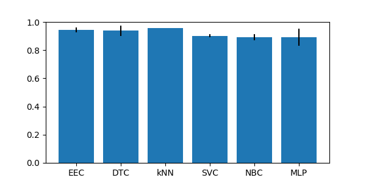

\emph{ecoli-0-2-6-7-vs-3-5} & purified & theta & 8 & 4.0 & 1 & \cellcolor{green!25} 0.942 & \cellcolor{green!25} 0.938 & \cellcolor{green!25} 0.955 & 0.902 & \cellcolor{green!25} 0.893 & \cellcolor{green!25} 0.893\\

### ecoli-0-3-4-6_vs_5 dataset

Best parameters
>	{'a_steps': 4, 'approach': 'purified', 'focus': 4, 'fuser': 'theta', 'grain': 8}

|CLF|ACC|STD|
|---|---|---|
| EEC | 0.946 | +-0.03|
| DTC | 0.937 | +-0.04|
| kNN | 0.976 | +-0.02|
| SVC | 0.902 | +-0.00|
| NBC | 0.771 | +-0.10|
| MLP | 0.932 | +-0.03|

\emph{ecoli-0-3-4-6-vs-5} & purified & theta & 8 & 4.0 & 4 & \cellcolor{green!25} 0.946 & \cellcolor{green!25} 0.937 & \cellcolor{green!25} 0.976 & \cellcolor{green!25} 0.902 & 0.771 & \cellcolor{green!25} 0.932\\

### ecoli-0-3-4-7_vs_5-6 dataset

Best parameters
>	{'a_steps': 3, 'approach': 'brute', 'focus': 4, 'fuser': 'theta', 'grain': 8}

|CLF|ACC|STD|
|---|---|---|
| EEC | 0.934 | +-0.02|
| DTC | 0.934 | +-0.02|
| kNN | 0.969 | +-0.03|
| SVC | 0.903 | +-0.00|
| NBC | 0.755 | +-0.10|
| MLP | 0.914 | +-0.02|

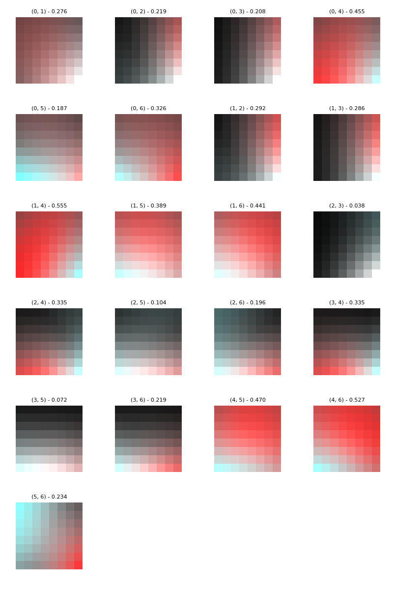
\emph{ecoli-0-3-4-7-vs-5-6} & brute & theta & 8 & 4.0 & 3 & \cellcolor{green!25} 0.934 & \cellcolor{green!25} 0.934 & \cellcolor{green!25} 0.969 & 0.903 & \cellcolor{green!25} 0.755 & \cellcolor{green!25} 0.914\\

### ecoli-0-3-4_vs_5 dataset

Best parameters
>	{'a_steps': 1, 'approach': 'brute', 'focus': 2, 'fuser': 'equal', 'grain': 8}

|CLF|ACC|STD|
|---|---|---|
| EEC | 0.970 | +-0.03|
| DTC | 0.945 | +-0.02|
| kNN | 0.975 | +-0.02|
| SVC | 0.900 | +-0.00|
| NBC | 0.750 | +-0.15|
| MLP | 0.935 | +-0.04|

\emph{ecoli-0-3-4-vs-5} & brute & equal & 8 & 2.0 & 1 & \cellcolor{green!25} 0.970 & \cellcolor{green!25} 0.945 & \cellcolor{green!25} 0.975 & 0.900 & \cellcolor{green!25} 0.750 & \cellcolor{green!25} 0.935\\

### ecoli-0-4-6_vs_5 dataset

Best parameters
>	{'a_steps': 1, 'approach': 'random', 'focus': 4, 'fuser': 'theta', 'grain': 16}

|CLF|ACC|STD|
|---|---|---|
| EEC | 0.975 | +-0.02|
| DTC | 0.936 | +-0.03|
| kNN | 0.980 | +-0.02|
| SVC | 0.901 | +-0.00|
| NBC | 0.897 | +-0.12|
| MLP | 0.956 | +-0.03|

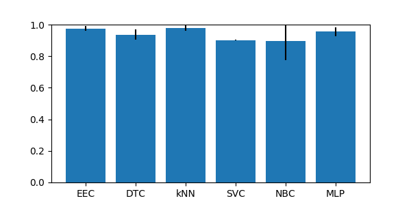

\emph{ecoli-0-4-6-vs-5} & random & theta & 16 & 4.0 & 1 & \cellcolor{green!25} 0.975 & \cellcolor{green!25} 0.936 & \cellcolor{green!25} 0.980 & 0.901 & \cellcolor{green!25} 0.897 & \cellcolor{green!25} 0.956\\

### ecoli-0-6-7_vs_3-5 dataset

Best parameters
>	{'a_steps': 1, 'approach': 'brute', 'focus': 4, 'fuser': 'theta', 'grain': 8}

|CLF|ACC|STD|
|---|---|---|
| EEC | 0.946 | +-0.03|
| DTC | 0.955 | +-0.04|
| kNN | 0.964 | +-0.04|
| SVC | 0.901 | +-0.01|
| NBC | 0.883 | +-0.01|
| MLP | 0.883 | +-0.03|

\emph{ecoli-0-6-7-vs-3-5} & brute & theta & 8 & 4.0 & 1 & \cellcolor{green!25} 0.946 & \cellcolor{green!25} 0.955 & \cellcolor{green!25} 0.964 & \cellcolor{green!25} 0.901 & \cellcolor{green!25} 0.883 & \cellcolor{green!25} 0.883\\

### ecoli-0-6-7_vs_5 dataset

Best parameters
>	{'a_steps': 1, 'approach': 'random', 'focus': 4, 'fuser': 'theta', 'grain': 8}

|CLF|ACC|STD|
|---|---|---|
| EEC | 0.959 | +-0.02|
| DTC | 0.955 | +-0.03|
| kNN | 0.968 | +-0.01|
| SVC | 0.909 | +-0.00|
| NBC | 0.886 | +-0.09|
| MLP | 0.886 | +-0.05|

\emph{ecoli-0-6-7-vs-5} & random & theta & 8 & 4.0 & 1 & \cellcolor{green!25} 0.959 & \cellcolor{green!25} 0.955 & \cellcolor{green!25} 0.968 & 0.909 & \cellcolor{green!25} 0.886 & \cellcolor{green!25} 0.886\\

### glass-0-1-4-6_vs_2 dataset

Best parameters
>	{'a_steps': 1, 'approach': 'random', 'focus': 2, 'fuser': 'equal', 'grain': 8}

|CLF|ACC|STD|
|---|---|---|
| EEC | 0.795 | +-0.06|
| DTC | 0.883 | +-0.05|
| kNN | 0.898 | +-0.02|
| SVC | 0.917 | +-0.01|
| NBC | 0.434 | +-0.05|
| MLP | 0.917 | +-0.01|

\emph{glass-0-1-4-6-vs-2} & random & equal & 8 & 2.0 & 1 & \cellcolor{blue!25} 0.795 & 0.883 & 0.898 & 0.917 & 0.434 & 0.917\\

### glass-0-1-5_vs_2 dataset

Best parameters
>	{'a_steps': 2, 'approach': 'brute', 'focus': 1, 'fuser': 'theta', 'grain': 32}

|CLF|ACC|STD|
|---|---|---|
| EEC | 0.832 | +-0.05|
| DTC | 0.820 | +-0.06|
| kNN | 0.895 | +-0.03|
| SVC | 0.901 | +-0.01|
| NBC | 0.452 | +-0.16|
| MLP | 0.901 | +-0.01|

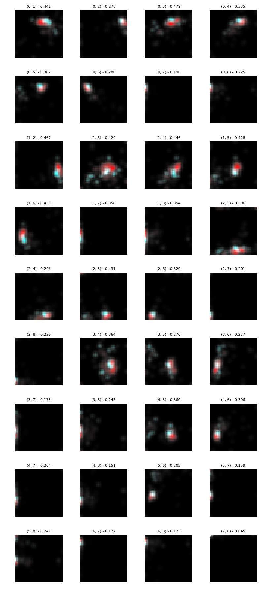
\emph{glass-0-1-5-vs-2} & brute & theta & 32 & 1.0 & 2 & \cellcolor{green!25} 0.832 & \cellcolor{green!25} 0.820 & \cellcolor{green!25} 0.895 & \cellcolor{green!25} 0.901 & 0.452 & \cellcolor{green!25} 0.901\\

### glass-0-4_vs_5 dataset

Best parameters
>	{'a_steps': 3, 'approach': 'purified', 'focus': 4, 'fuser': 'equal', 'grain': 32}

|CLF|ACC|STD|
|---|---|---|
| EEC | 0.935 | +-0.04|
| DTC | 0.989 | +-0.02|
| kNN | 0.967 | +-0.03|
| SVC | 0.923 | +-0.03|
| NBC | 0.989 | +-0.02|
| MLP | 0.913 | +-0.03|

\emph{glass-0-4-vs-5} & purified & equal & 32 & 4.0 & 3 & \cellcolor{green!25} 0.935 & \cellcolor{green!25} 0.989 & \cellcolor{green!25} 0.967 & \cellcolor{green!25} 0.923 & \cellcolor{green!25} 0.989 & \cellcolor{green!25} 0.913\\

### glass-0-6_vs_5 dataset

Best parameters
>	{'a_steps': 1, 'approach': 'brute', 'focus': 4, 'fuser': 'equal', 'grain': 16}

|CLF|ACC|STD|
|---|---|---|
| EEC | 0.944 | +-0.03|
| DTC | 0.981 | +-0.02|
| kNN | 0.945 | +-0.03|
| SVC | 0.935 | +-0.02|
| NBC | 0.981 | +-0.02|
| MLP | 0.917 | +-0.02|

\emph{glass-0-6-vs-5} & brute & equal & 16 & 4.0 & 1 & \cellcolor{green!25} 0.944 & \cellcolor{green!25} 0.981 & \cellcolor{green!25} 0.945 & \cellcolor{green!25} 0.935 & \cellcolor{green!25} 0.981 & \cellcolor{green!25} 0.917\\

### led7digit-0-2-4-5-6-7-8-9_vs_1 dataset

Best parameters
>	{'a_steps': 1, 'approach': 'brute', 'focus': 1, 'fuser': 'equal', 'grain': 8}

|CLF|ACC|STD|
|---|---|---|
| EEC | 0.876 | +-0.05|
| DTC | 0.966 | +-0.02|
| kNN | 0.932 | +-0.02|
| SVC | 0.968 | +-0.02|
| NBC | 0.880 | +-0.06|
| MLP | 0.966 | +-0.02|

\emph{led7digit-0-2-4-5-6-7-8-9-vs-1} & brute & equal & 8 & 1.0 & 1 & \cellcolor{blue!25} 0.876 & 0.966 & \cellcolor{blue!25} 0.932 & 0.968 & \cellcolor{blue!25} 0.880 & 0.966\\

### yeast-0-2-5-6_vs_3-7-8-9 dataset

Best parameters
>	{'a_steps': 3, 'approach': 'brute', 'focus': 4, 'fuser': 'equal', 'grain': 8}

|CLF|ACC|STD|
|---|---|---|
| EEC | 0.923 | +-0.01|
| DTC | 0.892 | +-0.01|
| kNN | 0.937 | +-0.02|
| SVC | 0.902 | +-0.00|
| NBC | 0.915 | +-0.02|
| MLP | 0.904 | +-0.01|

\emph{yeast-0-2-5-6-vs-3-7-8-9} & brute & equal & 8 & 4.0 & 3 & \cellcolor{green!25} 0.923 & 0.892 & \cellcolor{green!25} 0.937 & 0.902 & \cellcolor{green!25} 0.915 & \cellcolor{green!25} 0.904\\

### yeast-0-2-5-7-9_vs_3-6-8 dataset

Best parameters
>	{'a_steps': 1, 'approach': 'purified', 'focus': 4, 'fuser': 'equal', 'grain': 8}

|CLF|ACC|STD|
|---|---|---|
| EEC | 0.948 | +-0.01|
| DTC | 0.945 | +-0.01|
| kNN | 0.969 | +-0.00|
| SVC | 0.901 | +-0.00|
| NBC | 0.246 | +-0.05|
| MLP | 0.909 | +-0.01|

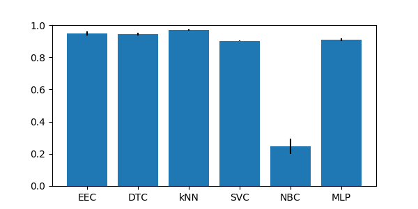

\emph{yeast-0-2-5-7-9-vs-3-6-8} & purified & equal & 8 & 4.0 & 1 & \cellcolor{green!25} 0.948 & \cellcolor{green!25} 0.945 & \cellcolor{green!25} 0.969 & 0.901 & 0.246 & 0.909\\

### yeast-0-3-5-9_vs_7-8 dataset

Best parameters
>	{'a_steps': 4, 'approach': 'brute', 'focus': 4, 'fuser': 'theta', 'grain': 8}

|CLF|ACC|STD|
|---|---|---|
| EEC | 0.907 | +-0.01|
| DTC | 0.864 | +-0.05|
| kNN | 0.911 | +-0.01|
| SVC | 0.905 | +-0.00|
| NBC | 0.202 | +-0.01|
| MLP | 0.901 | +-0.00|

\emph{yeast-0-3-5-9-vs-7-8} & brute & theta & 8 & 4.0 & 4 & \cellcolor{green!25} 0.907 & \cellcolor{green!25} 0.864 & \cellcolor{green!25} 0.911 & \cellcolor{green!25} 0.905 & 0.202 & \cellcolor{green!25} 0.901\\

## Group imb_IRlowerThan9

### ecoli-0_vs_1 dataset

Best parameters
>	{'a_steps': 1, 'approach': 'random', 'focus': 3, 'fuser': 'theta', 'grain': 32}

|CLF|ACC|STD|
|---|---|---|
| EEC | 0.982 | +-0.02|
| DTC | 0.968 | +-0.02|
| kNN | 0.986 | +-0.02|
| SVC | 0.964 | +-0.02|
| NBC | 0.945 | +-0.02|
| MLP | 0.959 | +-0.02|

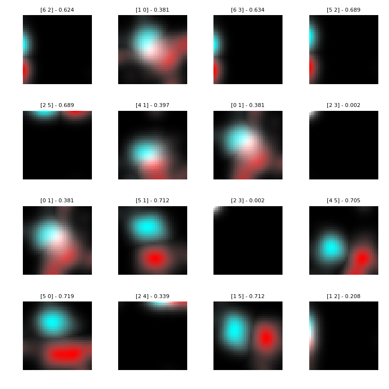
\emph{ecoli-0-vs-1} & random & theta & 32 & 3.0 & 1 & \cellcolor{green!25} 0.982 & \cellcolor{green!25} 0.968 & \cellcolor{green!25} 0.986 & \cellcolor{green!25} 0.964 & 0.945 & \cellcolor{green!25} 0.959\\

### ecoli1 dataset

Best parameters
>	{'a_steps': 1, 'approach': 'random', 'focus': 3, 'fuser': 'theta', 'grain': 16}

|CLF|ACC|STD|
|---|---|---|
| EEC | 0.872 | +-0.04|
| DTC | 0.887 | +-0.03|
| kNN | 0.929 | +-0.02|
| SVC | 0.863 | +-0.04|
| NBC | 0.653 | +-0.15|
| MLP | 0.881 | +-0.04|

\emph{ecoli1} & random & theta & 16 & 3.0 & 1 & \cellcolor{blue!25} 0.872 & \cellcolor{blue!25} 0.887 & 0.929 & \cellcolor{blue!25} 0.863 & \cellcolor{blue!25} 0.653 & \cellcolor{blue!25} 0.881\\

### ecoli2 dataset

Best parameters
>	{'a_steps': 2, 'approach': 'random', 'focus': 4, 'fuser': 'theta', 'grain': 8}

|CLF|ACC|STD|
|---|---|---|
| EEC | 0.902 | +-0.02|
| DTC | 0.905 | +-0.02|
| kNN | 0.967 | +-0.02|
| SVC | 0.845 | +-0.01|
| NBC | 0.351 | +-0.11|
| MLP | 0.896 | +-0.02|

\emph{ecoli2} & random & theta & 8 & 4.0 & 2 & \cellcolor{blue!25} 0.902 & \cellcolor{blue!25} 0.905 & 0.967 & 0.845 & 0.351 & \cellcolor{blue!25} 0.896\\

### ecoli3 dataset

Best parameters
>	{'a_steps': 1, 'approach': 'random', 'focus': 2, 'fuser': 'theta', 'grain': 8}

|CLF|ACC|STD|
|---|---|---|
| EEC | 0.922 | +-0.03|
| DTC | 0.893 | +-0.03|
| kNN | 0.928 | +-0.02|
| SVC | 0.896 | +-0.00|
| NBC | 0.771 | +-0.05|
| MLP | 0.899 | +-0.02|

\emph{ecoli3} & random & theta & 8 & 2.0 & 1 & \cellcolor{green!25} 0.922 & \cellcolor{green!25} 0.893 & \cellcolor{green!25} 0.928 & \cellcolor{green!25} 0.896 & 0.771 & \cellcolor{green!25} 0.899\\

### glass-0-1-2-3_vs_4-5-6 dataset

Best parameters
>	{'a_steps': 1, 'approach': 'random', 'focus': 1, 'fuser': 'theta', 'grain': 8}

|CLF|ACC|STD|
|---|---|---|
| EEC | 0.920 | +-0.03|
| DTC | 0.934 | +-0.02|
| kNN | 0.916 | +-0.02|
| SVC | 0.944 | +-0.03|
| NBC | 0.902 | +-0.05|
| MLP | 0.657 | +-0.17|

\emph{glass-0-1-2-3-vs-4-5-6} & random & theta & 8 & 1.0 & 1 & \cellcolor{green!25} 0.920 & \cellcolor{green!25} 0.934 & \cellcolor{green!25} 0.916 & \cellcolor{green!25} 0.944 & \cellcolor{green!25} 0.902 & 0.657\\

### glass0 dataset

Best parameters
>	{'a_steps': 1, 'approach': 'brute', 'focus': 1, 'fuser': 'equal', 'grain': 32}

|CLF|ACC|STD|
|---|---|---|
| EEC | 0.860 | +-0.05|
| DTC | 0.785 | +-0.05|
| kNN | 0.762 | +-0.09|
| SVC | 0.743 | +-0.04|
| NBC | 0.631 | +-0.02|
| MLP | 0.589 | +-0.16|

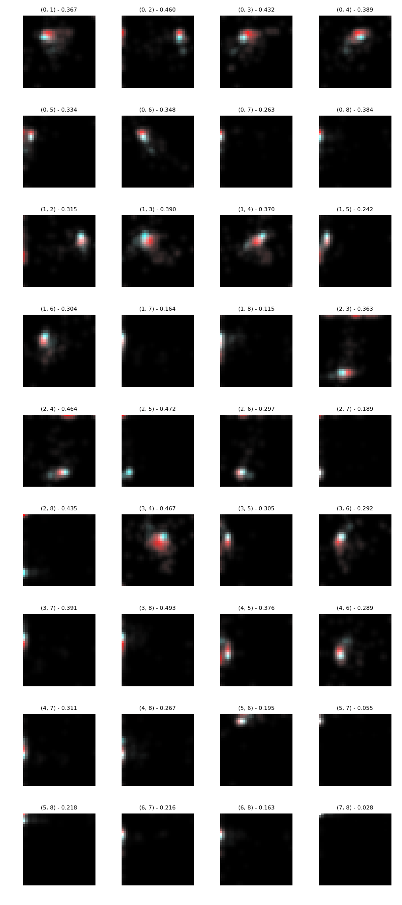
\emph{glass0} & brute & equal & 32 & 1.0 & 1 & \cellcolor{blue!25} 0.860 & \cellcolor{blue!25} 0.785 & 0.762 & 0.743 & 0.631 & 0.589\\

### glass1 dataset

Best parameters
>	{'a_steps': 1, 'approach': 'random', 'focus': 1, 'fuser': 'theta', 'grain': 32}

|CLF|ACC|STD|
|---|---|---|
| EEC | 0.776 | +-0.04|
| DTC | 0.757 | +-0.04|
| kNN | 0.786 | +-0.08|
| SVC | 0.771 | +-0.04|
| NBC | 0.603 | +-0.03|
| MLP | 0.575 | +-0.14|

\emph{glass1} & random & theta & 32 & 1.0 & 1 & \cellcolor{green!25} 0.776 & \cellcolor{green!25} 0.757 & \cellcolor{green!25} 0.786 & \cellcolor{green!25} 0.771 & 0.603 & 0.575\\

### glass6 dataset

Best parameters
>	{'a_steps': 1, 'approach': 'brute', 'focus': 4, 'fuser': 'equal', 'grain': 16}

|CLF|ACC|STD|
|---|---|---|
| EEC | 0.930 | +-0.01|
| DTC | 0.935 | +-0.02|
| kNN | 0.949 | +-0.02|
| SVC | 0.963 | +-0.02|
| NBC | 0.944 | +-0.04|
| MLP | 0.832 | +-0.07|

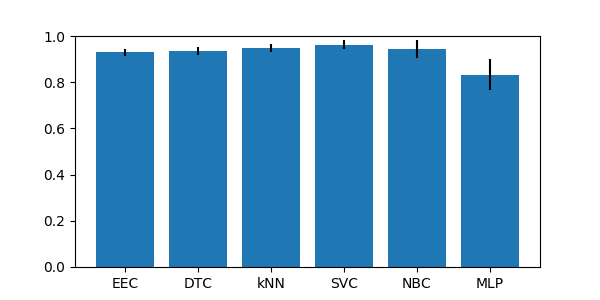

\emph{glass6} & brute & equal & 16 & 4.0 & 1 & \cellcolor{green!25} 0.930 & \cellcolor{green!25} 0.935 & \cellcolor{green!25} 0.949 & \cellcolor{green!25} 0.963 & \cellcolor{green!25} 0.944 & 0.832\\

### iris0 dataset

Best parameters
>	{'a_steps': 1, 'approach': 'brute', 'focus': 1, 'fuser': 'equal', 'grain': 8}

|CLF|ACC|STD|
|---|---|---|
| EEC | 1.000 | +-0.00|
| DTC | 1.000 | +-0.00|
| kNN | 1.000 | +-0.00|
| SVC | 1.000 | +-0.00|
| NBC | 1.000 | +-0.00|
| MLP | 1.000 | +-0.00|

\emph{iris0} & brute & equal & 8 & 1.0 & 1 & \cellcolor{blue!25} 1.000 & 1.000 & 1.000 & 1.000 & 1.000 & 1.000\\

### new-thyroid1 dataset

Best parameters
>	{'a_steps': 1, 'approach': 'random', 'focus': 2, 'fuser': 'theta', 'grain': 16}

|CLF|ACC|STD|
|---|---|---|
| EEC | 0.972 | +-0.03|
| DTC | 0.967 | +-0.02|
| kNN | 0.953 | +-0.03|
| SVC | 0.888 | +-0.02|
| NBC | 0.972 | +-0.03|
| MLP | 0.753 | +-0.16|

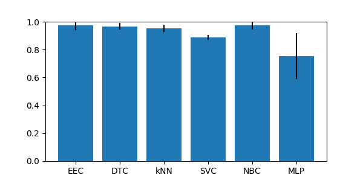

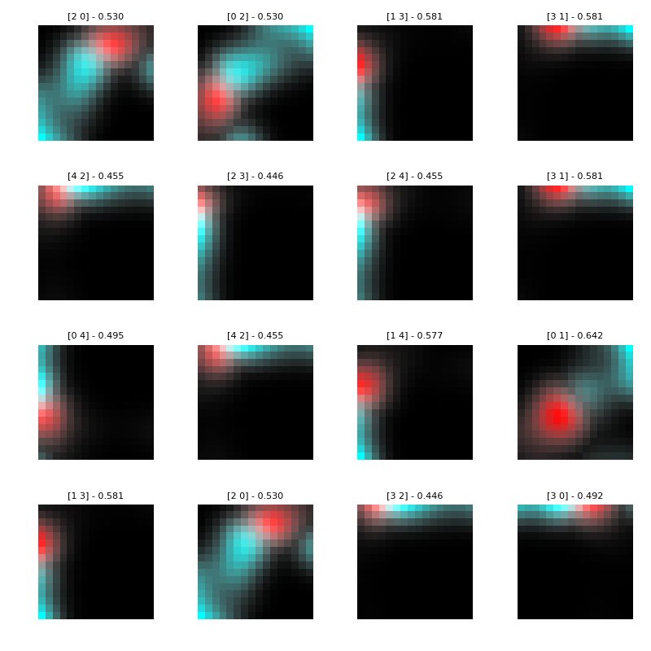
\emph{new-thyroid1} & random & theta & 16 & 2.0 & 1 & \cellcolor{blue!25} 0.972 & \cellcolor{blue!25} 0.967 & \cellcolor{blue!25} 0.953 & 0.888 & \cellcolor{blue!25} 0.972 & 0.753\\

### new-thyroid2 dataset

Best parameters
>	{'a_steps': 2, 'approach': 'brute', 'focus': 4, 'fuser': 'equal', 'grain': 32}

|CLF|ACC|STD|
|---|---|---|
| EEC | 0.972 | +-0.03|
| DTC | 0.958 | +-0.02|
| kNN | 0.953 | +-0.01|
| SVC | 0.884 | +-0.02|
| NBC | 0.977 | +-0.02|
| MLP | 0.809 | +-0.13|

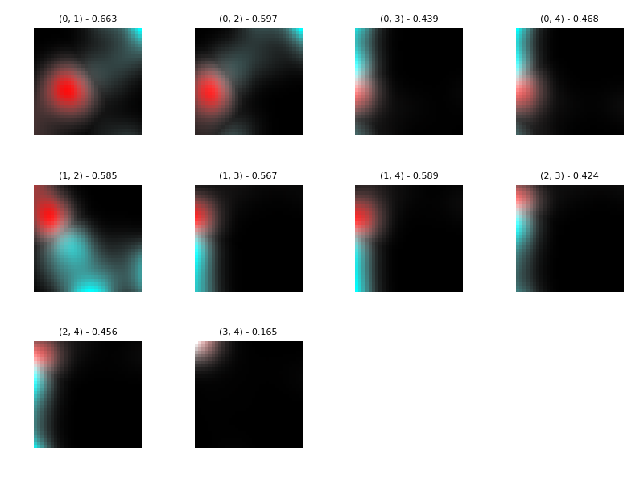
\emph{new-thyroid2} & brute & equal & 32 & 4.0 & 2 & \cellcolor{green!25} 0.972 & \cellcolor{green!25} 0.958 & \cellcolor{green!25} 0.953 & 0.884 & \cellcolor{green!25} 0.977 & 0.809\\

### pima dataset

Best parameters
>	{'a_steps': 2, 'approach': 'random', 'focus': 3, 'fuser': 'equal', 'grain': 8}

|CLF|ACC|STD|
|---|---|---|
| EEC | 0.768 | +-0.02|
| DTC | 0.702 | +-0.03|
| kNN | 0.721 | +-0.03|
| SVC | 0.651 | +-0.00|
| NBC | 0.756 | +-0.01|
| MLP | 0.641 | +-0.01|

\emph{pima} & random & equal & 8 & 3.0 & 2 & \cellcolor{blue!25} 0.768 & 0.702 & 0.721 & 0.651 & \cellcolor{blue!25} 0.756 & 0.641\\

### wisconsin dataset

Best parameters
>	{'a_steps': 1, 'approach': 'brute', 'focus': 3, 'fuser': 'theta', 'grain': 16}

|CLF|ACC|STD|
|---|---|---|
| EEC | 0.975 | +-0.00|
| DTC | 0.937 | +-0.02|
| kNN | 0.972 | +-0.01|
| SVC | 0.965 | +-0.01|
| NBC | 0.965 | +-0.01|
| MLP | 0.966 | +-0.01|

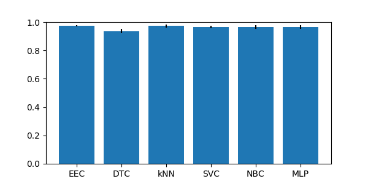

\emph{wisconsin} & brute & theta & 16 & 3.0 & 1 & \cellcolor{blue!25} 0.975 & 0.937 & \cellcolor{blue!25} 0.972 & \cellcolor{blue!25} 0.965 & \cellcolor{blue!25} 0.965 & \cellcolor{blue!25} 0.966\\

### yeast1 dataset

Best parameters
>	{'a_steps': 1, 'approach': 'brute', 'focus': 4, 'fuser': 'equal', 'grain': 32}

|CLF|ACC|STD|
|---|---|---|
| EEC | 0.705 | +-0.02|
| DTC | 0.718 | +-0.03|
| kNN | 0.739 | +-0.02|
| SVC | 0.720 | +-0.01|
| NBC | 0.321 | +-0.01|
| MLP | 0.759 | +-0.01|

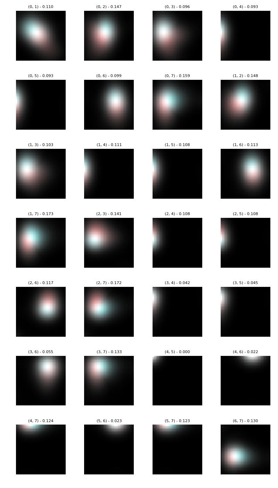
\emph{yeast1} & brute & equal & 32 & 4.0 & 1 & \cellcolor{blue!25} 0.705 & \cellcolor{blue!25} 0.718 & 0.739 & \cellcolor{blue!25} 0.720 & 0.321 & 0.759\\

### yeast3 dataset

Best parameters
>	{'a_steps': 4, 'approach': 'purified', 'focus': 3, 'fuser': 'equal', 'grain': 8}

|CLF|ACC|STD|
|---|---|---|
| EEC | 0.930 | +-0.02|
| DTC | 0.931 | +-0.01|
| kNN | 0.947 | +-0.01|
| SVC | 0.890 | +-0.00|
| NBC | 0.311 | +-0.07|
| MLP | 0.935 | +-0.01|

\emph{yeast3} & purified & equal & 8 & 3.0 & 4 & \cellcolor{green!25} 0.930 & \cellcolor{green!25} 0.931 & \cellcolor{green!25} 0.947 & 0.890 & 0.311 & \cellcolor{green!25} 0.935\\

## Group imb_multiclass

### balance dataset

Best parameters
>	{'a_steps': 1, 'approach': 'brute', 'focus': 4, 'fuser': 'equal', 'grain': 16}

|CLF|ACC|STD|
|---|---|---|
| EEC | 0.637 | +-0.06|
| DTC | 0.765 | +-0.02|
| kNN | 0.830 | +-0.03|
| SVC | 0.901 | +-0.01|
| NBC | 0.893 | +-0.01|
| MLP | 0.944 | +-0.01|

\emph{balance} & brute & equal & 16 & 4.0 & 1 & \cellcolor{blue!25} 0.637 & 0.765 & 0.830 & 0.901 & 0.893 & 0.944\\

### contraceptive dataset

Best parameters
>	{'a_steps': 4, 'approach': 'brute', 'focus': 1, 'fuser': 'theta', 'grain': 16}

|CLF|ACC|STD|
|---|---|---|
| EEC | 0.535 | +-0.02|
| DTC | 0.485 | +-0.03|
| kNN | 0.521 | +-0.02|
| SVC | 0.570 | +-0.01|
| NBC | 0.471 | +-0.03|
| MLP | 0.544 | +-0.03|

\emph{contraceptive} & brute & theta & 16 & 1.0 & 4 & \cellcolor{blue!25} 0.535 & 0.485 & \cellcolor{blue!25} 0.521 & 0.570 & 0.471 & \cellcolor{blue!25} 0.544\\

### ecoli dataset

Best parameters
>	{'a_steps': 2, 'approach': 'purified', 'focus': 1, 'fuser': 'equal', 'grain': 8}

|CLF|ACC|STD|
|---|---|---|
| EEC | 0.821 | +-0.03|
| DTC | 0.750 | +-0.02|
| kNN | 0.816 | +-0.03|
| SVC | 0.426 | +-0.01|
| NBC | 0.601 | +-0.05|
| MLP | 0.795 | +-0.04|

\emph{ecoli} & purified & equal & 8 & 1.0 & 2 & \cellcolor{blue!25} 0.821 & \cellcolor{blue!25} 0.750 & \cellcolor{blue!25} 0.816 & 0.426 & 0.601 & \cellcolor{blue!25} 0.795\\

### glass dataset

Best parameters
>	{'a_steps': 2, 'approach': 'brute', 'focus': 2, 'fuser': 'theta', 'grain': 32}

|CLF|ACC|STD|
|---|---|---|
| EEC | 0.645 | +-0.02|
| DTC | 0.682 | +-0.06|
| kNN | 0.650 | +-0.04|
| SVC | 0.673 | +-0.03|
| NBC | 0.429 | +-0.08|
| MLP | 0.350 | +-0.02|

\emph{glass} & brute & theta & 32 & 2.0 & 2 & \cellcolor{green!25} 0.645 & \cellcolor{green!25} 0.682 & \cellcolor{green!25} 0.650 & \cellcolor{green!25} 0.673 & 0.429 & 0.350\\

### hayes-roth dataset

Best parameters
>	{'a_steps': 1, 'approach': 'brute', 'focus': 1, 'fuser': 'theta', 'grain': 8}

|CLF|ACC|STD|
|---|---|---|
| EEC | 0.773 | +-0.02|
| DTC | 0.840 | +-0.06|
| kNN | 0.644 | +-0.05|
| SVC | 0.848 | +-0.06|
| NBC | 0.719 | +-0.07|
| MLP | 0.636 | +-0.07|

\emph{hayes-roth} & brute & theta & 8 & 1.0 & 1 & \cellcolor{blue!25} 0.773 & \cellcolor{blue!25} 0.840 & 0.644 & 0.848 & \cellcolor{blue!25} 0.719 & 0.636\\

### new-thyroid dataset

Best parameters
>	{'a_steps': 2, 'approach': 'brute', 'focus': 4, 'fuser': 'equal', 'grain': 32}

|CLF|ACC|STD|
|---|---|---|
| EEC | 0.958 | +-0.02|
| DTC | 0.940 | +-0.02|
| kNN | 0.930 | +-0.02|
| SVC | 0.749 | +-0.03|
| NBC | 0.963 | +-0.01|
| MLP | 0.553 | +-0.24|

\emph{new-thyroid} & brute & equal & 32 & 4.0 & 2 & \cellcolor{green!25} 0.958 & \cellcolor{green!25} 0.940 & 0.930 & 0.749 & \cellcolor{green!25} 0.963 & 0.553\\

### pageblocks dataset

Best parameters
>	{'a_steps': 1, 'approach': 'brute', 'focus': 1, 'fuser': 'equal', 'grain': 32}

|CLF|ACC|STD|
|---|---|---|
| EEC | 0.885 | +-0.04|
| DTC | 0.951 | +-0.03|
| kNN | 0.938 | +-0.01|
| SVC | 0.901 | +-0.01|
| NBC | 0.918 | +-0.02|
| MLP | 0.722 | +-0.31|

\emph{pageblocks} & brute & equal & 32 & 1.0 & 1 & \cellcolor{blue!25} 0.885 & 0.951 & \cellcolor{blue!25} 0.938 & \cellcolor{blue!25} 0.901 & \cellcolor{blue!25} 0.918 & \cellcolor{blue!25} 0.722\\

### shuttle dataset

Best parameters
>	{'a_steps': 1, 'approach': 'brute', 'focus': 1, 'fuser': 'equal', 'grain': 32}

|CLF|ACC|STD|
|---|---|---|
| EEC | 0.920 | +-0.03|
| DTC | 0.997 | +-0.00|
| kNN | 0.992 | +-0.00|
| SVC | 0.830 | +-0.01|
| NBC | 0.903 | +-0.02|
| MLP | 0.993 | +-0.00|

\emph{shuttle} & brute & equal & 32 & 1.0 & 1 & \cellcolor{blue!25} 0.920 & 0.997 & 0.992 & 0.830 & \cellcolor{blue!25} 0.903 & 0.993\\

### thyroid dataset

Best parameters
>	{'a_steps': 4, 'approach': 'brute', 'focus': 3, 'fuser': 'equal', 'grain': 8}

|CLF|ACC|STD|
|---|---|---|
| EEC | 0.921 | +-0.01|
| DTC | 0.985 | +-0.01|
| kNN | 0.925 | +-0.00|
| SVC | 0.925 | +-0.00|
| NBC | 0.174 | +-0.04|
| MLP | 0.925 | +-0.01|

\emph{thyroid} & brute & equal & 8 & 3.0 & 4 & \cellcolor{blue!25} 0.921 & 0.985 & \cellcolor{blue!25} 0.925 & \cellcolor{blue!25} 0.925 & 0.174 & \cellcolor{blue!25} 0.925\\

### wine dataset

Best parameters
>	{'a_steps': 2, 'approach': 'brute', 'focus': 3, 'fuser': 'equal', 'grain': 16}

|CLF|ACC|STD|
|---|---|---|
| EEC | 0.972 | +-0.04|
| DTC | 0.921 | +-0.04|
| kNN | 0.691 | +-0.05|
| SVC | 0.438 | +-0.03|
| NBC | 0.983 | +-0.02|
| MLP | 0.314 | +-0.05|

\emph{wine} & brute & equal & 16 & 3.0 & 2 & \cellcolor{green!25} 0.972 & \cellcolor{green!25} 0.921 & 0.691 & 0.438 & \cellcolor{green!25} 0.983 & 0.314\\

### yeast dataset

Best parameters
>	{'a_steps': 1, 'approach': 'brute', 'focus': 3, 'fuser': 'equal', 'grain': 8}

|CLF|ACC|STD|
|---|---|---|
| EEC | 0.494 | +-0.04|
| DTC | 0.481 | +-0.01|
| kNN | 0.559 | +-0.01|
| SVC | 0.423 | +-0.01|
| NBC | 0.146 | +-0.03|
| MLP | 0.574 | +-0.02|

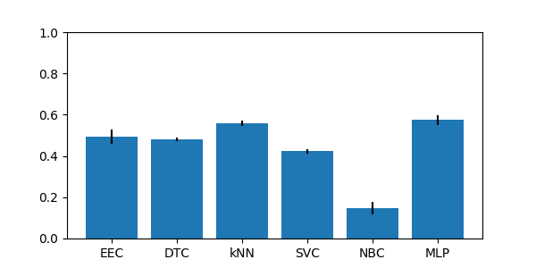

\emph{yeast} & brute & equal & 8 & 3.0 & 1 & \cellcolor{blue!25} 0.494 & \cellcolor{blue!25} 0.481 & 0.559 & 0.423 & 0.146 & 0.574\\

