## Group imb_IRhigherThan9p1

### ecoli-0-1-3-7_vs_2-6 dataset

Best parameters
{'a_steps': 1, 'approach': 'brute', 'focus': 3, 'fuser': 'equal', 'grain': 8}

|CLF|ACC|STD|
|---|---|---|
| SEE | 0.975 | +-0.02|
| OEE | 0.989 | +-0.01|
| DTC | 0.975 | +-0.01|
| kNN | 0.993 | +-0.01|
| SVC | 0.975 | +-0.01|
| NBC | 0.943 | +-0.03|

### ecoli4 dataset

Best parameters
{'a_steps': 1, 'approach': 'brute', 'focus': 4, 'fuser': 'theta', 'grain': 16}

|CLF|ACC|STD|
|---|---|---|
| SEE | 0.949 | +-0.03|
| OEE | 0.979 | +-0.02|
| DTC | 0.955 | +-0.01|
| kNN | 0.979 | +-0.02|
| SVC | 0.940 | +-0.00|
| NBC | 0.815 | +-0.13|

### glass-0-1-6_vs_2 dataset

Best parameters
{'a_steps': 1, 'approach': 'brute', 'focus': 1, 'fuser': 'equal', 'grain': 32}

|CLF|ACC|STD|
|---|---|---|
| SEE | 0.655 | +-0.13|
| OEE | 0.828 | +-0.05|
| DTC | 0.865 | +-0.04|
| kNN | 0.901 | +-0.02|
| SVC | 0.912 | +-0.01|
| NBC | 0.427 | +-0.06|

### glass-0-1-6_vs_5 dataset

Best parameters
{'a_steps': 1, 'approach': 'purified', 'focus': 4, 'fuser': 'equal', 'grain': 8}

|CLF|ACC|STD|
|---|---|---|
| SEE | 0.858 | +-0.09|
| OEE | 0.897 | +-0.06|
| DTC | 0.957 | +-0.04|
| kNN | 0.951 | +-0.03|
| SVC | 0.951 | +-0.01|
| NBC | 0.978 | +-0.01|

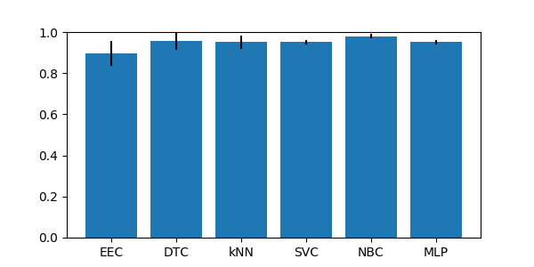

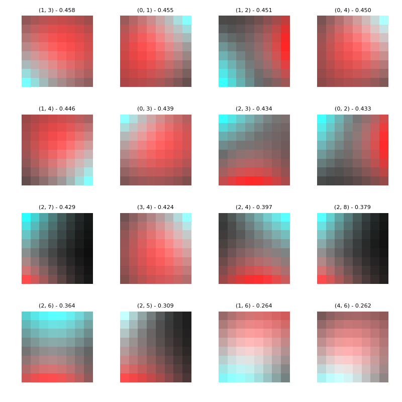

### glass2 dataset

Best parameters
{'a_steps': 2, 'approach': 'purified', 'focus': 4, 'fuser': 'theta', 'grain': 8}

|CLF|ACC|STD|
|---|---|---|
| SEE | 0.710 | +-0.04|
| OEE | 0.832 | +-0.04|
| DTC | 0.860 | +-0.07|
| kNN | 0.892 | +-0.02|
| SVC | 0.921 | +-0.01|
| NBC | 0.457 | +-0.06|

### glass4 dataset

Best parameters
{'a_steps': 1, 'approach': 'brute', 'focus': 4, 'fuser': 'equal', 'grain': 32}

|CLF|ACC|STD|
|---|---|---|
| SEE | 0.878 | +-0.04|
| OEE | 0.958 | +-0.03|
| DTC | 0.953 | +-0.04|
| kNN | 0.967 | +-0.02|
| SVC | 0.958 | +-0.02|
| NBC | 0.897 | +-0.04|

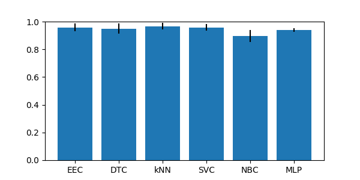

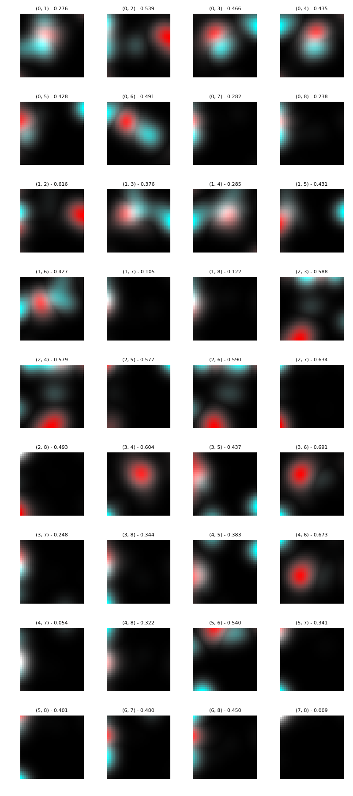

### glass5 dataset

Best parameters
{'a_steps': 1, 'approach': 'purified', 'focus': 4, 'fuser': 'equal', 'grain': 8}

|CLF|ACC|STD|
|---|---|---|
| SEE | 0.827 | +-0.08|
| OEE | 0.916 | +-0.07|
| DTC | 0.991 | +-0.01|
| kNN | 0.963 | +-0.02|
| SVC | 0.958 | +-0.01|
| NBC | 0.972 | +-0.03|

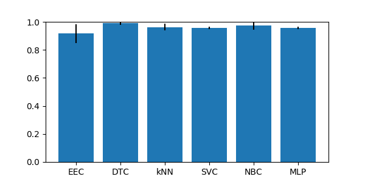

### page-blocks-1-3_vs_4 dataset

Best parameters
{'a_steps': 1, 'approach': 'random', 'focus': 1, 'fuser': 'equal', 'grain': 32}

|CLF|ACC|STD|
|---|---|---|
| SEE | 0.536 | +-0.03|
| OEE | 0.858 | +-0.05|
| DTC | 0.992 | +-0.01|
| kNN | 0.955 | +-0.03|
| SVC | 0.941 | +-0.00|
| NBC | 0.930 | +-0.02|

### shuttle-c0-vs-c4 dataset

Best parameters
{'a_steps': 1, 'approach': 'brute', 'focus': 1, 'fuser': 'equal', 'grain': 8}

|CLF|ACC|STD|
|---|---|---|
| SEE | 1.000 | +-0.00|
| OEE | 1.000 | +-0.00|
| DTC | 1.000 | +-0.00|
| kNN | 0.999 | +-0.00|
| SVC | 0.940 | +-0.00|
| NBC | 0.997 | +-0.00|

### shuttle-c2-vs-c4 dataset

Best parameters
{'a_steps': 1, 'approach': 'brute', 'focus': 1, 'fuser': 'equal', 'grain': 8}

|CLF|ACC|STD|
|---|---|---|
| SEE | 1.000 | +-0.00|
| OEE | 1.000 | +-0.00|
| DTC | 1.000 | +-0.00|
| kNN | 0.961 | +-0.02|
| SVC | 0.954 | +-0.02|
| NBC | 0.992 | +-0.02|

### vowel0 dataset

Best parameters
{'a_steps': 4, 'approach': 'purified', 'focus': 3, 'fuser': 'theta', 'grain': 8}

|CLF|ACC|STD|
|---|---|---|
| SEE | 0.923 | +-0.01|
| OEE | 0.963 | +-0.01|
| DTC | 0.986 | +-0.01|
| kNN | 0.995 | +-0.00|
| SVC | 0.997 | +-0.01|
| NBC | 0.939 | +-0.02|

### yeast-0-5-6-7-9_vs_4 dataset

Best parameters
{'a_steps': 1, 'approach': 'purified', 'focus': 4, 'fuser': 'equal', 'grain': 8}

|CLF|ACC|STD|
|---|---|---|
| SEE | 0.848 | +-0.02|
| OEE | 0.898 | +-0.03|
| DTC | 0.865 | +-0.02|
| kNN | 0.917 | +-0.01|
| SVC | 0.903 | +-0.00|
| NBC | 0.134 | +-0.03|

### yeast-1-2-8-9_vs_7 dataset

Best parameters
{'a_steps': 4, 'approach': 'random', 'focus': 4, 'fuser': 'theta', 'grain': 8}

|CLF|ACC|STD|
|---|---|---|
| SEE | 0.558 | +-0.09|
| OEE | 0.967 | +-0.01|
| DTC | 0.943 | +-0.01|
| kNN | 0.967 | +-0.00|
| SVC | 0.968 | +-0.00|
| NBC | 0.117 | +-0.05|

### yeast-1-4-5-8_vs_7 dataset

Best parameters
{'a_steps': 4, 'approach': 'brute', 'focus': 4, 'fuser': 'equal', 'grain': 8}

|CLF|ACC|STD|
|---|---|---|
| SEE | 0.707 | +-0.06|
| OEE | 0.935 | +-0.04|
| DTC | 0.902 | +-0.02|
| kNN | 0.955 | +-0.00|
| SVC | 0.957 | +-0.00|
| NBC | 0.133 | +-0.05|

### yeast-1_vs_7 dataset

Best parameters
{'a_steps': 1, 'approach': 'brute', 'focus': 1, 'fuser': 'equal', 'grain': 32}

|CLF|ACC|STD|
|---|---|---|
| SEE | 0.747 | +-0.07|
| OEE | 0.902 | +-0.02|
| DTC | 0.895 | +-0.01|
| kNN | 0.937 | +-0.00|
| SVC | 0.935 | +-0.00|
| NBC | 0.259 | +-0.04|

### yeast-2_vs_4 dataset

Best parameters
{'a_steps': 3, 'approach': 'brute', 'focus': 3, 'fuser': 'equal', 'grain': 8}

|CLF|ACC|STD|
|---|---|---|
| SEE | 0.932 | +-0.03|
| OEE | 0.955 | +-0.01|
| DTC | 0.936 | +-0.02|
| kNN | 0.959 | +-0.01|
| SVC | 0.901 | +-0.00|
| NBC | 0.239 | +-0.04|

### yeast-2_vs_8 dataset

Best parameters
{'a_steps': 4, 'approach': 'brute', 'focus': 4, 'fuser': 'equal', 'grain': 8}

|CLF|ACC|STD|
|---|---|---|
| SEE | 0.832 | +-0.11|
| OEE | 0.963 | +-0.01|
| DTC | 0.961 | +-0.01|
| kNN | 0.979 | +-0.01|
| SVC | 0.977 | +-0.00|
| NBC | 0.389 | +-0.30|

### yeast4 dataset

Best parameters
{'a_steps': 4, 'approach': 'brute', 'focus': 4, 'fuser': 'equal', 'grain': 8}

|CLF|ACC|STD|
|---|---|---|
| SEE | 0.868 | +-0.01|
| OEE | 0.952 | +-0.02|
| DTC | 0.949 | +-0.01|
| kNN | 0.965 | +-0.00|
| SVC | 0.966 | +-0.00|
| NBC | 0.168 | +-0.05|

### yeast5 dataset

Best parameters
{'a_steps': 2, 'approach': 'random', 'focus': 4, 'fuser': 'equal', 'grain': 8}

|CLF|ACC|STD|
|---|---|---|
| SEE | 0.921 | +-0.01|
| OEE | 0.975 | +-0.01|
| DTC | 0.982 | +-0.00|
| kNN | 0.985 | +-0.01|
| SVC | 0.970 | +-0.00|
| NBC | 0.671 | +-0.04|

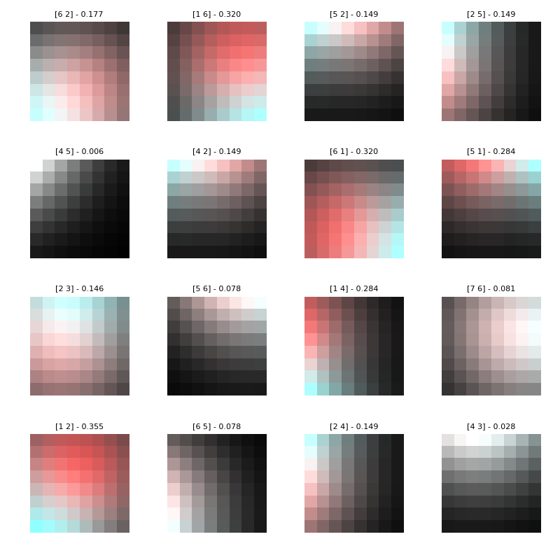

### yeast6 dataset

Best parameters
{'a_steps': 4, 'approach': 'brute', 'focus': 4, 'fuser': 'equal', 'grain': 8}

|CLF|ACC|STD|
|---|---|---|
| SEE | 0.894 | +-0.01|
| OEE | 0.957 | +-0.01|
| DTC | 0.968 | +-0.01|
| kNN | 0.980 | +-0.01|
| SVC | 0.976 | +-0.00|
| NBC | 0.316 | +-0.07|

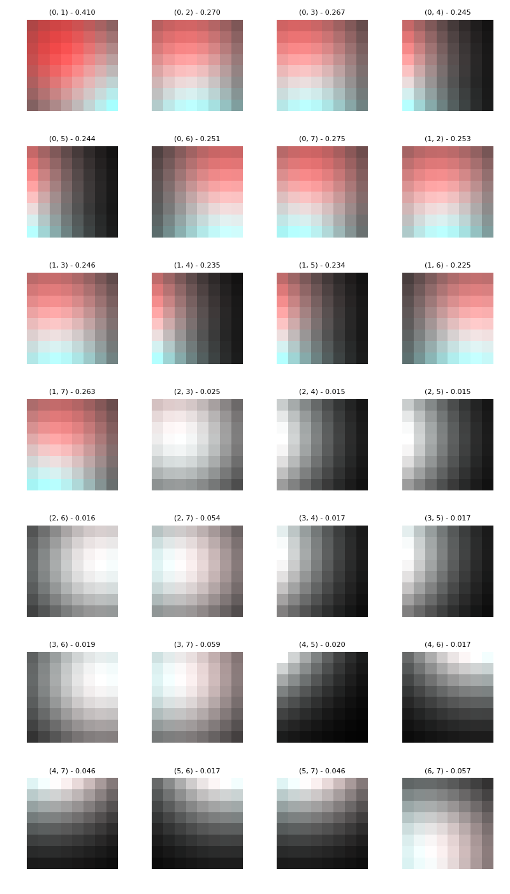
## Group imb_IRhigherThan9p2

### ecoli-0-1-4-6_vs_5 dataset

Best parameters
{'a_steps': 1, 'approach': 'random', 'focus': 4, 'fuser': 'equal', 'grain': 16}

|CLF|ACC|STD|
|---|---|---|
| SEE | 0.982 | +-0.01|
| OEE | 0.975 | +-0.02|
| DTC | 0.932 | +-0.03|
| kNN | 0.982 | +-0.01|
| SVC | 0.929 | +-0.00|
| NBC | 0.943 | +-0.05|

### ecoli-0-1-4-7_vs_2-3-5-6 dataset

Best parameters
{'a_steps': 3, 'approach': 'purified', 'focus': 3, 'fuser': 'equal', 'grain': 8}

|CLF|ACC|STD|
|---|---|---|
| SEE | 0.929 | +-0.01|
| OEE | 0.944 | +-0.02|
| DTC | 0.938 | +-0.01|
| kNN | 0.973 | +-0.01|
| SVC | 0.914 | +-0.01|
| NBC | 0.932 | +-0.01|

### ecoli-0-1-4-7_vs_5-6 dataset

Best parameters
{'a_steps': 3, 'approach': 'random', 'focus': 3, 'fuser': 'theta', 'grain': 8}

|CLF|ACC|STD|
|---|---|---|
| SEE | 0.940 | +-0.02|
| OEE | 0.958 | +-0.02|
| DTC | 0.952 | +-0.02|
| kNN | 0.973 | +-0.02|
| SVC | 0.925 | +-0.00|
| NBC | 0.952 | +-0.03|

### ecoli-0-1_vs_2-3-5 dataset

Best parameters
{'a_steps': 2, 'approach': 'purified', 'focus': 4, 'fuser': 'equal', 'grain': 16}

|CLF|ACC|STD|
|---|---|---|
| SEE | 0.963 | +-0.02|
| OEE | 0.963 | +-0.02|
| DTC | 0.914 | +-0.02|
| kNN | 0.967 | +-0.01|
| SVC | 0.902 | +-0.01|
| NBC | 0.926 | +-0.04|

### ecoli-0-1_vs_5 dataset

Best parameters
{'a_steps': 4, 'approach': 'random', 'focus': 4, 'fuser': 'equal', 'grain': 16}

|CLF|ACC|STD|
|---|---|---|
| SEE | 0.979 | +-0.02|
| OEE | 0.979 | +-0.01|
| DTC | 0.958 | +-0.03|
| kNN | 0.983 | +-0.02|
| SVC | 0.917 | +-0.00|
| NBC | 0.933 | +-0.06|

### ecoli-0-2-3-4_vs_5 dataset

Best parameters
{'a_steps': 1, 'approach': 'purified', 'focus': 3, 'fuser': 'equal', 'grain': 8}

|CLF|ACC|STD|
|---|---|---|
| SEE | 0.970 | +-0.04|
| OEE | 0.950 | +-0.02|
| DTC | 0.936 | +-0.03|
| kNN | 0.970 | +-0.04|
| SVC | 0.901 | +-0.00|
| NBC | 0.677 | +-0.15|

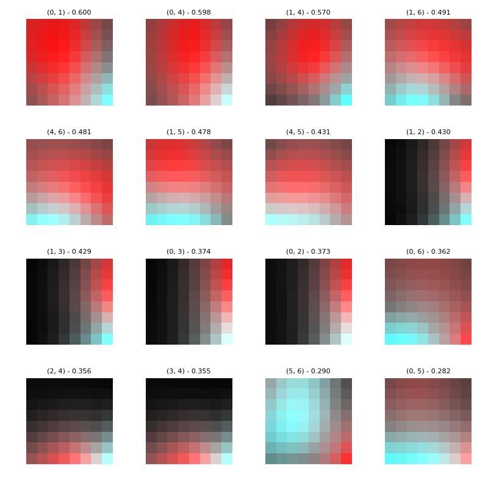

### ecoli-0-2-6-7_vs_3-5 dataset

Best parameters
{'a_steps': 1, 'approach': 'purified', 'focus': 4, 'fuser': 'theta', 'grain': 8}

|CLF|ACC|STD|
|---|---|---|
| SEE | 0.911 | +-0.05|
| OEE | 0.942 | +-0.02|
| DTC | 0.915 | +-0.07|
| kNN | 0.955 | +-0.00|
| SVC | 0.902 | +-0.01|
| NBC | 0.893 | +-0.02|

### ecoli-0-3-4-6_vs_5 dataset

Best parameters
{'a_steps': 4, 'approach': 'purified', 'focus': 4, 'fuser': 'theta', 'grain': 8}

|CLF|ACC|STD|
|---|---|---|
| SEE | 0.976 | +-0.03|
| OEE | 0.946 | +-0.03|
| DTC | 0.937 | +-0.04|
| kNN | 0.976 | +-0.02|
| SVC | 0.902 | +-0.00|
| NBC | 0.771 | +-0.10|

### ecoli-0-3-4-7_vs_5-6 dataset

Best parameters
{'a_steps': 3, 'approach': 'brute', 'focus': 4, 'fuser': 'theta', 'grain': 8}

|CLF|ACC|STD|
|---|---|---|
| SEE | 0.926 | +-0.02|
| OEE | 0.934 | +-0.02|
| DTC | 0.934 | +-0.02|
| kNN | 0.969 | +-0.03|
| SVC | 0.903 | +-0.00|
| NBC | 0.755 | +-0.10|

### ecoli-0-3-4_vs_5 dataset

Best parameters
{'a_steps': 1, 'approach': 'brute', 'focus': 2, 'fuser': 'equal', 'grain': 8}

|CLF|ACC|STD|
|---|---|---|
| SEE | 0.975 | +-0.02|
| OEE | 0.970 | +-0.03|
| DTC | 0.935 | +-0.03|
| kNN | 0.975 | +-0.02|
| SVC | 0.900 | +-0.00|
| NBC | 0.750 | +-0.15|

### ecoli-0-4-6_vs_5 dataset

Best parameters
{'a_steps': 1, 'approach': 'random', 'focus': 4, 'fuser': 'theta', 'grain': 16}

|CLF|ACC|STD|
|---|---|---|
| SEE | 0.966 | +-0.02|
| OEE | 0.975 | +-0.02|
| DTC | 0.941 | +-0.02|
| kNN | 0.980 | +-0.02|
| SVC | 0.901 | +-0.00|
| NBC | 0.897 | +-0.12|

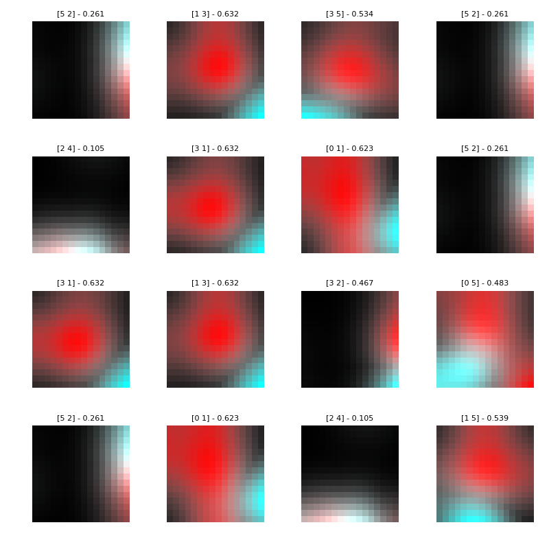

### ecoli-0-6-7_vs_3-5 dataset

Best parameters
{'a_steps': 1, 'approach': 'brute', 'focus': 4, 'fuser': 'theta', 'grain': 8}

|CLF|ACC|STD|
|---|---|---|
| SEE | 0.937 | +-0.03|
| OEE | 0.946 | +-0.03|
| DTC | 0.951 | +-0.04|
| kNN | 0.964 | +-0.04|
| SVC | 0.901 | +-0.01|
| NBC | 0.883 | +-0.01|

### ecoli-0-6-7_vs_5 dataset

Best parameters
{'a_steps': 1, 'approach': 'random', 'focus': 4, 'fuser': 'theta', 'grain': 8}

|CLF|ACC|STD|
|---|---|---|
| SEE | 0.941 | +-0.04|
| OEE | 0.959 | +-0.02|
| DTC | 0.950 | +-0.04|
| kNN | 0.968 | +-0.01|
| SVC | 0.909 | +-0.00|
| NBC | 0.886 | +-0.09|

### glass-0-1-4-6_vs_2 dataset

Best parameters
{'a_steps': 1, 'approach': 'random', 'focus': 2, 'fuser': 'equal', 'grain': 8}

|CLF|ACC|STD|
|---|---|---|
| SEE | 0.732 | +-0.07|
| OEE | 0.795 | +-0.06|
| DTC | 0.883 | +-0.04|
| kNN | 0.898 | +-0.02|
| SVC | 0.917 | +-0.01|
| NBC | 0.434 | +-0.05|

### glass-0-1-5_vs_2 dataset

Best parameters
{'a_steps': 2, 'approach': 'brute', 'focus': 1, 'fuser': 'theta', 'grain': 32}

|CLF|ACC|STD|
|---|---|---|
| SEE | 0.588 | +-0.06|
| OEE | 0.832 | +-0.05|
| DTC | 0.814 | +-0.09|
| kNN | 0.895 | +-0.03|
| SVC | 0.901 | +-0.01|
| NBC | 0.452 | +-0.16|

### glass-0-4_vs_5 dataset

Best parameters
{'a_steps': 3, 'approach': 'purified', 'focus': 4, 'fuser': 'equal', 'grain': 32}

|CLF|ACC|STD|
|---|---|---|
| SEE | 0.891 | +-0.10|
| OEE | 0.935 | +-0.04|
| DTC | 0.989 | +-0.02|
| kNN | 0.967 | +-0.03|
| SVC | 0.923 | +-0.03|
| NBC | 0.989 | +-0.02|

### glass-0-6_vs_5 dataset

Best parameters
{'a_steps': 1, 'approach': 'brute', 'focus': 4, 'fuser': 'equal', 'grain': 16}

|CLF|ACC|STD|
|---|---|---|
| SEE | 0.991 | +-0.02|
| OEE | 0.944 | +-0.03|
| DTC | 0.972 | +-0.02|
| kNN | 0.945 | +-0.03|
| SVC | 0.935 | +-0.02|
| NBC | 0.981 | +-0.02|

### led7digit-0-2-4-5-6-7-8-9_vs_1 dataset

Best parameters
{'a_steps': 1, 'approach': 'brute', 'focus': 1, 'fuser': 'equal', 'grain': 8}

|CLF|ACC|STD|
|---|---|---|
| SEE | 0.858 | +-0.05|
| OEE | 0.876 | +-0.05|
| DTC | 0.966 | +-0.02|
| kNN | 0.932 | +-0.02|
| SVC | 0.968 | +-0.02|
| NBC | 0.880 | +-0.06|

### yeast-0-2-5-6_vs_3-7-8-9 dataset

Best parameters
{'a_steps': 3, 'approach': 'brute', 'focus': 4, 'fuser': 'equal', 'grain': 8}

|CLF|ACC|STD|
|---|---|---|
| SEE | 0.829 | +-0.02|
| OEE | 0.923 | +-0.01|
| DTC | 0.894 | +-0.01|
| kNN | 0.937 | +-0.02|
| SVC | 0.902 | +-0.00|
| NBC | 0.915 | +-0.02|

### yeast-0-2-5-7-9_vs_3-6-8 dataset

Best parameters
{'a_steps': 1, 'approach': 'purified', 'focus': 4, 'fuser': 'equal', 'grain': 8}

|CLF|ACC|STD|
|---|---|---|
| SEE | 0.910 | +-0.02|
| OEE | 0.948 | +-0.01|
| DTC | 0.942 | +-0.01|
| kNN | 0.969 | +-0.00|
| SVC | 0.901 | +-0.00|
| NBC | 0.246 | +-0.05|

### yeast-0-3-5-9_vs_7-8 dataset

Best parameters
{'a_steps': 4, 'approach': 'brute', 'focus': 4, 'fuser': 'theta', 'grain': 8}

|CLF|ACC|STD|
|---|---|---|
| SEE | 0.848 | +-0.03|
| OEE | 0.907 | +-0.01|
| DTC | 0.864 | +-0.04|
| kNN | 0.911 | +-0.01|
| SVC | 0.905 | +-0.00|
| NBC | 0.202 | +-0.01|

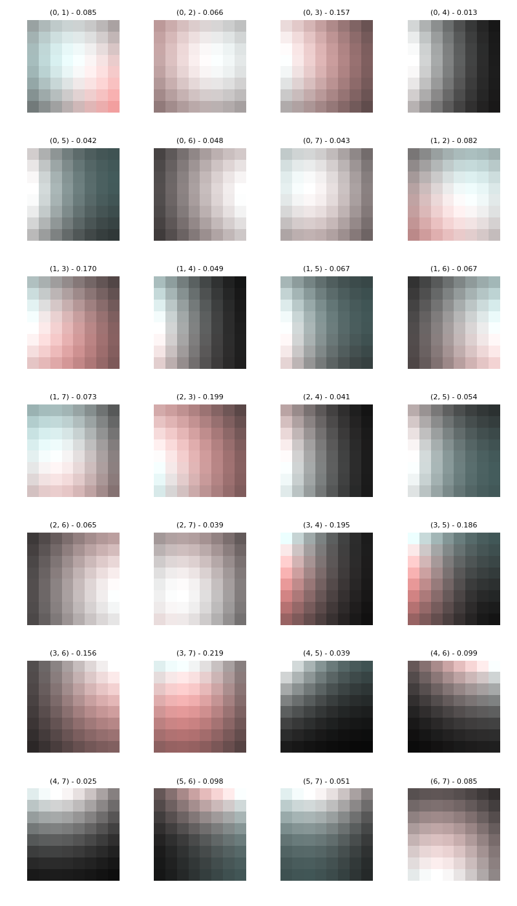
## Group imb_IRlowerThan9

### ecoli-0_vs_1 dataset

Best parameters
{'a_steps': 1, 'approach': 'random', 'focus': 3, 'fuser': 'theta', 'grain': 32}

|CLF|ACC|STD|
|---|---|---|
| SEE | 0.982 | +-0.02|
| OEE | 0.982 | +-0.02|
| DTC | 0.973 | +-0.03|
| kNN | 0.986 | +-0.02|
| SVC | 0.964 | +-0.02|
| NBC | 0.945 | +-0.02|

### ecoli1 dataset

Best parameters
{'a_steps': 1, 'approach': 'random', 'focus': 3, 'fuser': 'theta', 'grain': 16}

|CLF|ACC|STD|
|---|---|---|
| SEE | 0.869 | +-0.04|
| OEE | 0.872 | +-0.04|
| DTC | 0.881 | +-0.03|
| kNN | 0.929 | +-0.02|
| SVC | 0.863 | +-0.04|
| NBC | 0.653 | +-0.15|

### ecoli2 dataset

Best parameters
{'a_steps': 2, 'approach': 'random', 'focus': 4, 'fuser': 'theta', 'grain': 8}

|CLF|ACC|STD|
|---|---|---|
| SEE | 0.905 | +-0.05|
| OEE | 0.902 | +-0.02|
| DTC | 0.920 | +-0.02|
| kNN | 0.967 | +-0.02|
| SVC | 0.845 | +-0.01|
| NBC | 0.351 | +-0.11|

### ecoli3 dataset

Best parameters
{'a_steps': 1, 'approach': 'random', 'focus': 2, 'fuser': 'theta', 'grain': 8}

|CLF|ACC|STD|
|---|---|---|
| SEE | 0.842 | +-0.03|
| OEE | 0.922 | +-0.03|
| DTC | 0.887 | +-0.03|
| kNN | 0.928 | +-0.02|
| SVC | 0.896 | +-0.00|
| NBC | 0.771 | +-0.05|

### glass-0-1-2-3_vs_4-5-6 dataset

Best parameters
{'a_steps': 1, 'approach': 'random', 'focus': 1, 'fuser': 'theta', 'grain': 8}

|CLF|ACC|STD|
|---|---|---|
| SEE | 0.911 | +-0.03|
| OEE | 0.920 | +-0.03|
| DTC | 0.949 | +-0.03|
| kNN | 0.916 | +-0.02|
| SVC | 0.944 | +-0.03|
| NBC | 0.902 | +-0.05|

### glass0 dataset

Best parameters
{'a_steps': 1, 'approach': 'brute', 'focus': 1, 'fuser': 'equal', 'grain': 32}

|CLF|ACC|STD|
|---|---|---|
| SEE | 0.766 | +-0.03|
| OEE | 0.860 | +-0.05|
| DTC | 0.799 | +-0.04|
| kNN | 0.762 | +-0.09|
| SVC | 0.743 | +-0.04|
| NBC | 0.631 | +-0.02|

### glass1 dataset

Best parameters
{'a_steps': 1, 'approach': 'random', 'focus': 1, 'fuser': 'theta', 'grain': 32}

|CLF|ACC|STD|
|---|---|---|
| SEE | 0.668 | +-0.05|
| OEE | 0.776 | +-0.04|
| DTC | 0.748 | +-0.06|
| kNN | 0.786 | +-0.08|
| SVC | 0.771 | +-0.04|
| NBC | 0.603 | +-0.03|

### glass6 dataset

Best parameters
{'a_steps': 1, 'approach': 'brute', 'focus': 4, 'fuser': 'equal', 'grain': 16}

|CLF|ACC|STD|
|---|---|---|
| SEE | 0.930 | +-0.03|
| OEE | 0.930 | +-0.01|
| DTC | 0.925 | +-0.01|
| kNN | 0.949 | +-0.02|
| SVC | 0.963 | +-0.02|
| NBC | 0.944 | +-0.04|

### iris0 dataset

Best parameters
{'a_steps': 1, 'approach': 'brute', 'focus': 1, 'fuser': 'equal', 'grain': 8}

|CLF|ACC|STD|
|---|---|---|
| SEE | 1.000 | +-0.00|
| OEE | 1.000 | +-0.00|
| DTC | 1.000 | +-0.00|
| kNN | 1.000 | +-0.00|
| SVC | 1.000 | +-0.00|
| NBC | 1.000 | +-0.00|

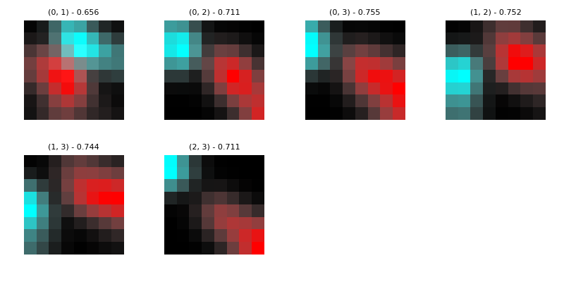

### new-thyroid1 dataset

Best parameters
{'a_steps': 1, 'approach': 'random', 'focus': 2, 'fuser': 'theta', 'grain': 16}

|CLF|ACC|STD|
|---|---|---|
| SEE | 0.977 | +-0.03|
| OEE | 0.972 | +-0.03|
| DTC | 0.977 | +-0.03|
| kNN | 0.953 | +-0.03|
| SVC | 0.888 | +-0.02|
| NBC | 0.972 | +-0.03|

### new-thyroid2 dataset

Best parameters
{'a_steps': 2, 'approach': 'brute', 'focus': 4, 'fuser': 'equal', 'grain': 32}

|CLF|ACC|STD|
|---|---|---|
| SEE | 0.986 | +-0.02|
| OEE | 0.972 | +-0.03|
| DTC | 0.958 | +-0.02|
| kNN | 0.953 | +-0.01|
| SVC | 0.884 | +-0.02|
| NBC | 0.977 | +-0.02|

### pima dataset

Best parameters
{'a_steps': 2, 'approach': 'random', 'focus': 3, 'fuser': 'equal', 'grain': 8}

|CLF|ACC|STD|
|---|---|---|
| SEE | 0.643 | +-0.04|
| OEE | 0.768 | +-0.02|
| DTC | 0.707 | +-0.03|
| kNN | 0.721 | +-0.03|
| SVC | 0.651 | +-0.00|
| NBC | 0.756 | +-0.01|

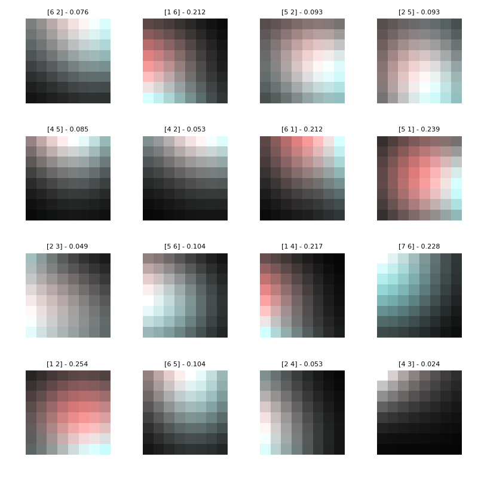

### wisconsin dataset

Best parameters
{'a_steps': 1, 'approach': 'brute', 'focus': 3, 'fuser': 'theta', 'grain': 16}

|CLF|ACC|STD|
|---|---|---|
| SEE | 0.972 | +-0.01|
| OEE | 0.975 | +-0.00|
| DTC | 0.940 | +-0.02|
| kNN | 0.972 | +-0.01|
| SVC | 0.965 | +-0.01|
| NBC | 0.965 | +-0.01|

### yeast1 dataset

Best parameters
{'a_steps': 1, 'approach': 'brute', 'focus': 4, 'fuser': 'equal', 'grain': 32}

|CLF|ACC|STD|
|---|---|---|
| SEE | 0.692 | +-0.04|
| OEE | 0.705 | +-0.02|
| DTC | 0.723 | +-0.02|
| kNN | 0.739 | +-0.02|
| SVC | 0.720 | +-0.01|
| NBC | 0.321 | +-0.01|

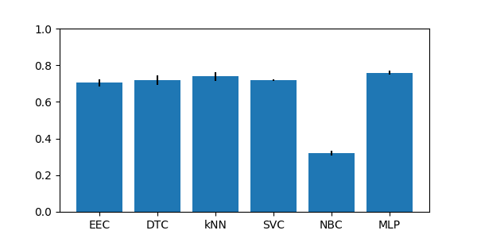

### yeast3 dataset

Best parameters
{'a_steps': 4, 'approach': 'purified', 'focus': 3, 'fuser': 'equal', 'grain': 8}

|CLF|ACC|STD|
|---|---|---|
| SEE | 0.894 | +-0.01|
| OEE | 0.930 | +-0.02|
| DTC | 0.934 | +-0.01|
| kNN | 0.947 | +-0.01|
| SVC | 0.890 | +-0.00|
| NBC | 0.311 | +-0.07|

## Group imb_multiclass

### balance dataset

Best parameters
{'a_steps': 1, 'approach': 'brute', 'focus': 4, 'fuser': 'equal', 'grain': 16}

|CLF|ACC|STD|
|---|---|---|
| SEE | 0.690 | +-0.08|
| OEE | 0.637 | +-0.06|
| DTC | 0.768 | +-0.02|
| kNN | 0.830 | +-0.03|
| SVC | 0.901 | +-0.01|
| NBC | 0.893 | +-0.01|

### contraceptive dataset

Best parameters
{'a_steps': 4, 'approach': 'brute', 'focus': 1, 'fuser': 'theta', 'grain': 16}

|CLF|ACC|STD|
|---|---|---|
| SEE | 0.491 | +-0.02|
| OEE | 0.535 | +-0.02|
| DTC | 0.478 | +-0.03|
| kNN | 0.521 | +-0.02|
| SVC | 0.570 | +-0.01|
| NBC | 0.471 | +-0.03|

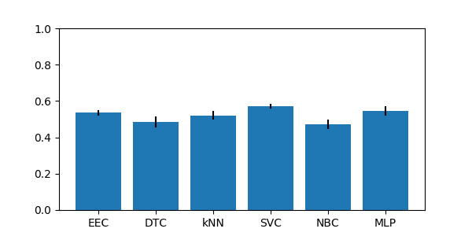

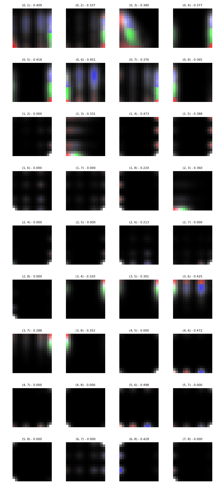

### ecoli dataset

Best parameters
{'a_steps': 2, 'approach': 'purified', 'focus': 1, 'fuser': 'equal', 'grain': 8}

|CLF|ACC|STD|
|---|---|---|
| SEE | 0.833 | +-0.03|
| OEE | 0.821 | +-0.03|
| DTC | 0.768 | +-0.04|
| kNN | 0.816 | +-0.03|
| SVC | 0.426 | +-0.01|
| NBC | 0.601 | +-0.05|

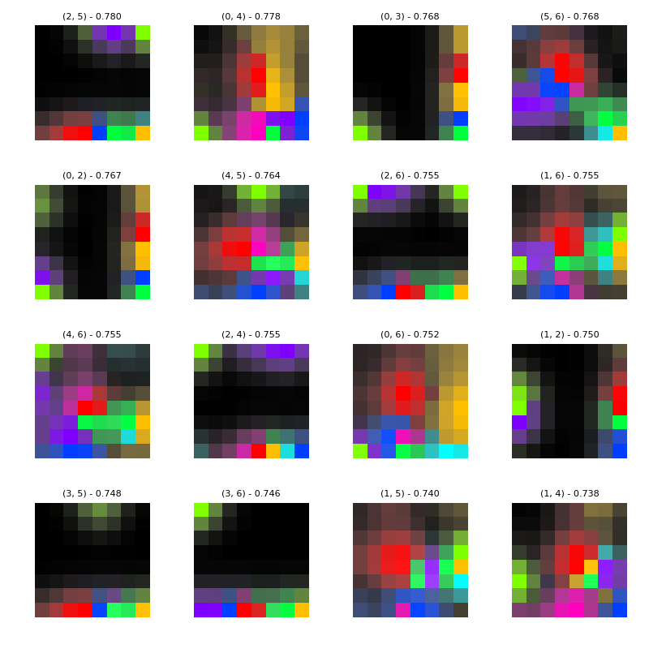

### glass dataset

Best parameters
{'a_steps': 2, 'approach': 'brute', 'focus': 2, 'fuser': 'theta', 'grain': 32}

|CLF|ACC|STD|
|---|---|---|
| SEE | 0.528 | +-0.05|
| OEE | 0.645 | +-0.02|
| DTC | 0.678 | +-0.06|
| kNN | 0.650 | +-0.04|
| SVC | 0.673 | +-0.03|
| NBC | 0.429 | +-0.08|

### hayes-roth dataset

Best parameters
{'a_steps': 1, 'approach': 'brute', 'focus': 1, 'fuser': 'theta', 'grain': 8}

|CLF|ACC|STD|
|---|---|---|
| SEE | 0.644 | +-0.06|
| OEE | 0.773 | +-0.02|
| DTC | 0.840 | +-0.06|
| kNN | 0.644 | +-0.05|
| SVC | 0.848 | +-0.06|
| NBC | 0.719 | +-0.07|

### new-thyroid dataset

Best parameters
{'a_steps': 2, 'approach': 'brute', 'focus': 4, 'fuser': 'equal', 'grain': 32}

|CLF|ACC|STD|
|---|---|---|
| SEE | 0.949 | +-0.04|
| OEE | 0.958 | +-0.02|
| DTC | 0.944 | +-0.01|
| kNN | 0.930 | +-0.02|
| SVC | 0.749 | +-0.03|
| NBC | 0.963 | +-0.01|

### pageblocks dataset

Best parameters
{'a_steps': 1, 'approach': 'brute', 'focus': 1, 'fuser': 'equal', 'grain': 32}

|CLF|ACC|STD|
|---|---|---|
| SEE | 0.746 | +-0.03|
| OEE | 0.885 | +-0.04|
| DTC | 0.945 | +-0.02|
| kNN | 0.938 | +-0.01|
| SVC | 0.901 | +-0.01|
| NBC | 0.918 | +-0.02|

### shuttle dataset

Best parameters
{'a_steps': 1, 'approach': 'brute', 'focus': 1, 'fuser': 'equal', 'grain': 32}

|CLF|ACC|STD|
|---|---|---|
| SEE | 0.786 | +-0.02|
| OEE | 0.920 | +-0.03|
| DTC | 0.997 | +-0.00|
| kNN | 0.992 | +-0.00|
| SVC | 0.830 | +-0.01|
| NBC | 0.903 | +-0.02|

### thyroid dataset

Best parameters
{'a_steps': 4, 'approach': 'brute', 'focus': 3, 'fuser': 'equal', 'grain': 8}

|CLF|ACC|STD|
|---|---|---|
| SEE | 0.658 | +-0.07|
| OEE | 0.921 | +-0.01|
| DTC | 0.978 | +-0.01|
| kNN | 0.925 | +-0.00|
| SVC | 0.925 | +-0.00|
| NBC | 0.174 | +-0.04|

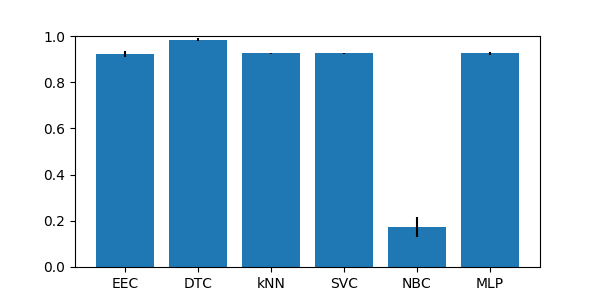

### wine dataset

Best parameters
{'a_steps': 2, 'approach': 'brute', 'focus': 3, 'fuser': 'equal', 'grain': 16}

|CLF|ACC|STD|
|---|---|---|
| SEE | 0.966 | +-0.03|
| OEE | 0.972 | +-0.04|
| DTC | 0.915 | +-0.04|
| kNN | 0.691 | +-0.05|
| SVC | 0.438 | +-0.03|
| NBC | 0.983 | +-0.02|

### yeast dataset

Best parameters
{'a_steps': 1, 'approach': 'brute', 'focus': 3, 'fuser': 'equal', 'grain': 8}

|CLF|ACC|STD|
|---|---|---|
| SEE | 0.449 | +-0.02|
| OEE | 0.494 | +-0.04|
| DTC | 0.481 | +-0.01|
| kNN | 0.559 | +-0.01|
| SVC | 0.423 | +-0.01|
| NBC | 0.146 | +-0.03|

