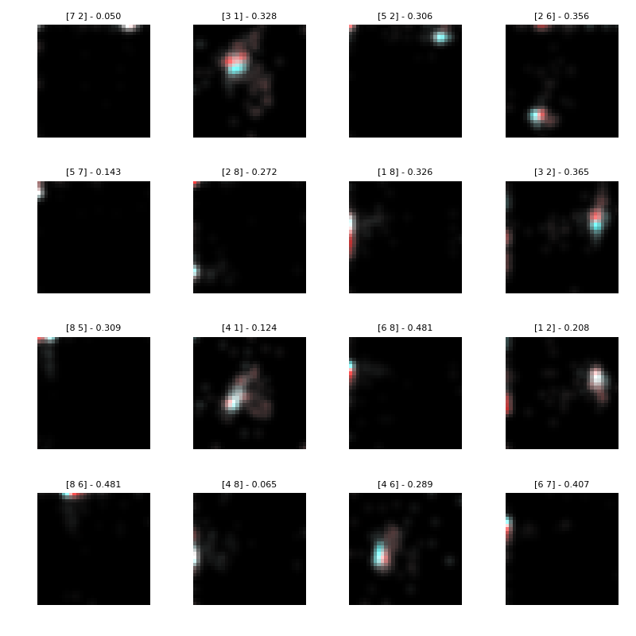

## Group imb_IRlowerThan9

### ecoli-0_vs_1 dataset

|CLF|ACC|STD|
|---|---|---|
|  EE | 0.97 | +-0.02|
| DTC | 0.97 | +-0.02|
| kNN | 0.99 | +-0.02|
| SVC | 0.96 | +-0.02|
| NBC | 0.95 | +-0.02|

### ecoli1 dataset

|CLF|ACC|STD|
|---|---|---|
|  EE | 0.87 | +-0.03|
| DTC | 0.88 | +-0.03|
| kNN | 0.93 | +-0.02|
| SVC | 0.86 | +-0.04|
| NBC | 0.65 | +-0.15|

### ecoli2 dataset

|CLF|ACC|STD|
|---|---|---|
|  EE | 0.90 | +-0.05|
| DTC | 0.90 | +-0.02|
| kNN | 0.97 | +-0.02|
| SVC | 0.85 | +-0.01|
| NBC | 0.35 | +-0.11|

### ecoli3 dataset

|CLF|ACC|STD|
|---|---|---|
|  EE | 0.85 | +-0.03|
| DTC | 0.90 | +-0.02|
| kNN | 0.93 | +-0.02|
| SVC | 0.90 | +-0.00|
| NBC | 0.77 | +-0.05|

### glass-0-1-2-3_vs_4-5-6 dataset

|CLF|ACC|STD|
|---|---|---|
|  EE | 0.91 | +-0.03|
| DTC | 0.93 | +-0.03|
| kNN | 0.92 | +-0.02|
| SVC | 0.94 | +-0.03|
| NBC | 0.90 | +-0.05|

### glass0 dataset

|CLF|ACC|STD|
|---|---|---|
|  EE | 0.79 | +-0.02|
| DTC | 0.80 | +-0.06|
| kNN | 0.76 | +-0.09|
| SVC | 0.74 | +-0.04|
| NBC | 0.63 | +-0.02|

### glass1 dataset

|CLF|ACC|STD|
|---|---|---|
|  EE | 0.76 | +-0.04|
| DTC | 0.76 | +-0.03|
| kNN | 0.79 | +-0.08|
| SVC | 0.77 | +-0.04|
| NBC | 0.60 | +-0.03|

### glass6 dataset

|CLF|ACC|STD|
|---|---|---|
|  EE | 0.95 | +-0.02|
| DTC | 0.92 | +-0.02|
| kNN | 0.95 | +-0.02|
| SVC | 0.96 | +-0.02|
| NBC | 0.94 | +-0.04|

### haberman dataset
