## Group imb_IRhigherThan9p1

### ecoli-0-1-3-7_vs_2-6 dataset

Best parameters
{'a_steps': 5, 'focus': 5}

|CLF|ACC|STD|
|---|---|---|
| SEE | 0.98 | +-0.02|
| OEE | 0.99 | +-0.01|
| DTC | 0.96 | +-0.02|
| kNN | 0.99 | +-0.01|
| SVC | 0.98 | +-0.01|
| NBC | 0.94 | +-0.03|

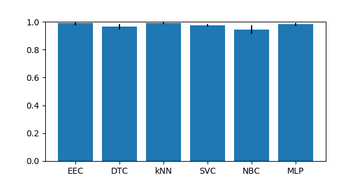

### ecoli4 dataset

Best parameters
{'a_steps': 3, 'focus': 5}

|CLF|ACC|STD|
|---|---|---|
| SEE | 0.89 | +-0.04|
| OEE | 0.98 | +-0.02|
| DTC | 0.96 | +-0.01|
| kNN | 0.98 | +-0.02|
| SVC | 0.94 | +-0.00|
| NBC | 0.82 | +-0.13|

### glass-0-1-6_vs_2 dataset

Best parameters
{'a_steps': 0, 'focus': 0}

|CLF|ACC|STD|
|---|---|---|
| SEE | 0.57 | +-0.19|
| OEE | 0.75 | +-0.06|
| DTC | 0.87 | +-0.04|
| kNN | 0.90 | +-0.02|
| SVC | 0.91 | +-0.01|
| NBC | 0.43 | +-0.06|

### glass-0-1-6_vs_5 dataset

Best parameters
{'a_steps': 0, 'focus': 5}

|CLF|ACC|STD|
|---|---|---|
| SEE | 0.84 | +-0.07|
| OEE | 0.92 | +-0.07|
| DTC | 0.96 | +-0.04|
| kNN | 0.95 | +-0.03|
| SVC | 0.95 | +-0.01|
| NBC | 0.98 | +-0.01|

### glass2 dataset

Best parameters
{'a_steps': 2, 'focus': 0}

|CLF|ACC|STD|
|---|---|---|
| SEE | 0.60 | +-0.12|
| OEE | 0.81 | +-0.03|
| DTC | 0.85 | +-0.08|
| kNN | 0.89 | +-0.02|
| SVC | 0.92 | +-0.01|
| NBC | 0.46 | +-0.06|

### glass4 dataset

Best parameters
{'a_steps': 0, 'focus': 5}

|CLF|ACC|STD|
|---|---|---|
| SEE | 0.87 | +-0.07|
| OEE | 0.93 | +-0.03|
| DTC | 0.95 | +-0.04|
| kNN | 0.97 | +-0.02|
| SVC | 0.96 | +-0.02|
| NBC | 0.90 | +-0.04|

### glass5 dataset

Best parameters
{'a_steps': 0, 'focus': 5}

|CLF|ACC|STD|
|---|---|---|
| SEE | 0.79 | +-0.08|
| OEE | 0.96 | +-0.02|
| DTC | 0.99 | +-0.01|
| kNN | 0.96 | +-0.02|
| SVC | 0.96 | +-0.01|
| NBC | 0.97 | +-0.03|

### page-blocks-1-3_vs_4 dataset

Best parameters
{'a_steps': 0, 'focus': 0}

|CLF|ACC|STD|
|---|---|---|
| SEE | 0.61 | +-0.04|
| OEE | 0.91 | +-0.01|
| DTC | 0.99 | +-0.01|
| kNN | 0.96 | +-0.03|
| SVC | 0.94 | +-0.00|
| NBC | 0.93 | +-0.02|

### shuttle-c0-vs-c4 dataset

Best parameters
{'a_steps': 0, 'focus': 1}

|CLF|ACC|STD|
|---|---|---|
| SEE | 1.00 | +-0.00|
| OEE | 1.00 | +-0.00|
| DTC | 1.00 | +-0.00|
| kNN | 1.00 | +-0.00|
| SVC | 0.94 | +-0.00|
| NBC | 1.00 | +-0.00|

### shuttle-c2-vs-c4 dataset

Best parameters
{'a_steps': 0, 'focus': 2}

|CLF|ACC|STD|
|---|---|---|
| SEE | 0.99 | +-0.02|
| OEE | 1.00 | +-0.00|
| DTC | 0.99 | +-0.02|
| kNN | 0.96 | +-0.02|
| SVC | 0.95 | +-0.02|
| NBC | 0.99 | +-0.02|

### vowel0 dataset

Best parameters
{'a_steps': 0, 'focus': 5}

|CLF|ACC|STD|
|---|---|---|
| SEE | 0.93 | +-0.01|
| OEE | 0.96 | +-0.01|
| DTC | 0.98 | +-0.01|
| kNN | 0.99 | +-0.00|
| SVC | 1.00 | +-0.01|
| NBC | 0.94 | +-0.02|

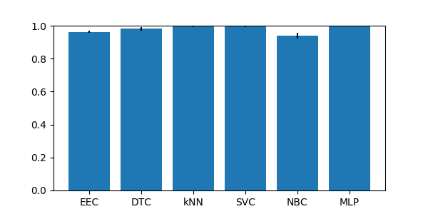

### yeast-0-5-6-7-9_vs_4 dataset

Best parameters
{'a_steps': 4, 'focus': 5}

|CLF|ACC|STD|
|---|---|---|
| SEE | 0.72 | +-0.05|
| OEE | 0.88 | +-0.02|
| DTC | 0.87 | +-0.02|
| kNN | 0.92 | +-0.01|
| SVC | 0.90 | +-0.00|
| NBC | 0.13 | +-0.03|

### yeast-1-2-8-9_vs_7 dataset

Best parameters
{'a_steps': 5, 'focus': 5}

|CLF|ACC|STD|
|---|---|---|
| SEE | 0.53 | +-0.05|
| OEE | 0.86 | +-0.05|
| DTC | 0.94 | +-0.01|
| kNN | 0.97 | +-0.00|
| SVC | 0.97 | +-0.00|
| NBC | 0.12 | +-0.05|

### yeast-1-4-5-8_vs_7 dataset

Best parameters
{'a_steps': 0, 'focus': 0}

|CLF|ACC|STD|
|---|---|---|
| SEE | 0.65 | +-0.11|
| OEE | 0.88 | +-0.04|
| DTC | 0.90 | +-0.02|
| kNN | 0.96 | +-0.00|
| SVC | 0.96 | +-0.00|
| NBC | 0.13 | +-0.05|

### yeast-1_vs_7 dataset

Best parameters
{'a_steps': 0, 'focus': 0}

|CLF|ACC|STD|
|---|---|---|
| SEE | 0.70 | +-0.09|
| OEE | 0.90 | +-0.03|
| DTC | 0.89 | +-0.01|
| kNN | 0.94 | +-0.00|
| SVC | 0.93 | +-0.00|
| NBC | 0.26 | +-0.04|

### yeast-2_vs_4 dataset

Best parameters
{'a_steps': 3, 'focus': 5}

|CLF|ACC|STD|
|---|---|---|
| SEE | 0.88 | +-0.02|
| OEE | 0.96 | +-0.00|
| DTC | 0.93 | +-0.02|
| kNN | 0.96 | +-0.01|
| SVC | 0.90 | +-0.00|
| NBC | 0.24 | +-0.04|

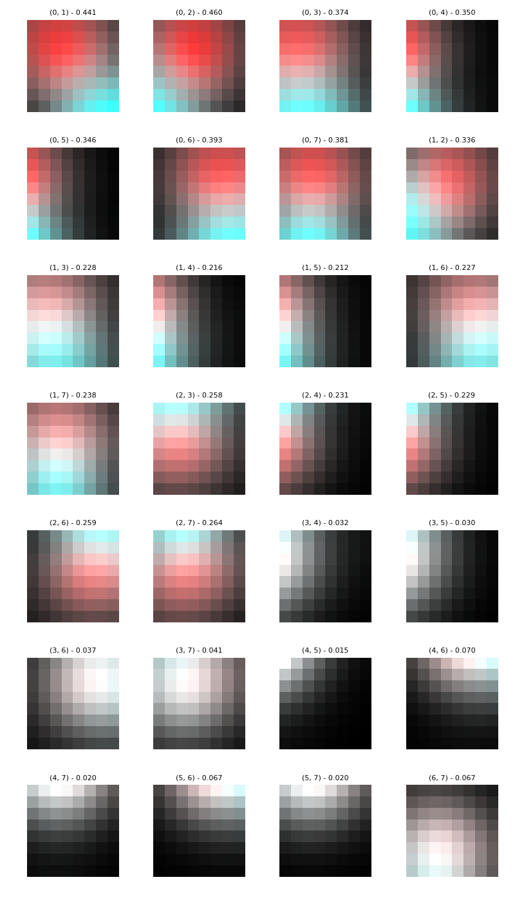

### yeast-2_vs_8 dataset

Best parameters
{'a_steps': 0, 'focus': 0}

|CLF|ACC|STD|
|---|---|---|
| SEE | 0.80 | +-0.11|
| OEE | 0.91 | +-0.03|
| DTC | 0.96 | +-0.01|
| kNN | 0.98 | +-0.01|
| SVC | 0.98 | +-0.00|
| NBC | 0.39 | +-0.30|

### yeast4 dataset

Best parameters
{'a_steps': 4, 'focus': 5}

|CLF|ACC|STD|
|---|---|---|
| SEE | 0.74 | +-0.02|
| OEE | 0.91 | +-0.02|
| DTC | 0.95 | +-0.01|
| kNN | 0.96 | +-0.00|
| SVC | 0.97 | +-0.00|
| NBC | 0.17 | +-0.05|

### yeast5 dataset

Best parameters
{'a_steps': 5, 'focus': 5}

|CLF|ACC|STD|
|---|---|---|
| SEE | 0.89 | +-0.02|
| OEE | 0.94 | +-0.01|
| DTC | 0.98 | +-0.00|
| kNN | 0.99 | +-0.01|
| SVC | 0.97 | +-0.00|
| NBC | 0.67 | +-0.04|

### yeast6 dataset

Best parameters
{'a_steps': 0, 'focus': 0}

|CLF|ACC|STD|
|---|---|---|
| SEE | 0.86 | +-0.03|
| OEE | 0.92 | +-0.01|
| DTC | 0.96 | +-0.01|
| kNN | 0.98 | +-0.01|
| SVC | 0.98 | +-0.00|
| NBC | 0.32 | +-0.07|

## Group imb_IRhigherThan9p2

### ecoli-0-1-4-6_vs_5 dataset

Best parameters
{'a_steps': 0, 'focus': 4}

|CLF|ACC|STD|
|---|---|---|
| SEE | 0.98 | +-0.01|
| OEE | 0.98 | +-0.02|
| DTC | 0.93 | +-0.03|
| kNN | 0.98 | +-0.01|
| SVC | 0.93 | +-0.00|
| NBC | 0.94 | +-0.05|

### ecoli-0-1-4-7_vs_2-3-5-6 dataset

Best parameters
{'a_steps': 0, 'focus': 3}

|CLF|ACC|STD|
|---|---|---|
| SEE | 0.90 | +-0.01|
| OEE | 0.94 | +-0.02|
| DTC | 0.94 | +-0.02|
| kNN | 0.97 | +-0.01|
| SVC | 0.91 | +-0.01|
| NBC | 0.93 | +-0.01|

### ecoli-0-1-4-7_vs_5-6 dataset

Best parameters
{'a_steps': 0, 'focus': 5}

|CLF|ACC|STD|
|---|---|---|
| SEE | 0.94 | +-0.03|
| OEE | 0.95 | +-0.02|
| DTC | 0.95 | +-0.02|
| kNN | 0.97 | +-0.02|
| SVC | 0.92 | +-0.00|
| NBC | 0.95 | +-0.03|

### ecoli-0-1_vs_2-3-5 dataset

Best parameters
{'a_steps': 0, 'focus': 4}

|CLF|ACC|STD|
|---|---|---|
| SEE | 0.96 | +-0.02|
| OEE | 0.96 | +-0.03|
| DTC | 0.92 | +-0.04|
| kNN | 0.97 | +-0.01|
| SVC | 0.90 | +-0.01|
| NBC | 0.93 | +-0.04|

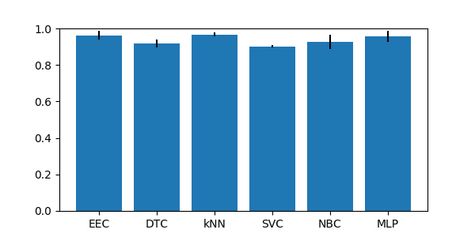

### ecoli-0-1_vs_5 dataset

Best parameters
{'a_steps': 0, 'focus': 4}

|CLF|ACC|STD|
|---|---|---|
| SEE | 0.97 | +-0.02|
| OEE | 0.97 | +-0.02|
| DTC | 0.96 | +-0.03|
| kNN | 0.98 | +-0.02|
| SVC | 0.92 | +-0.00|
| NBC | 0.93 | +-0.06|

### ecoli-0-2-3-4_vs_5 dataset

Best parameters
{'a_steps': 1, 'focus': 4}

|CLF|ACC|STD|
|---|---|---|
| SEE | 0.98 | +-0.02|
| OEE | 0.98 | +-0.02|
| DTC | 0.95 | +-0.02|
| kNN | 0.97 | +-0.04|
| SVC | 0.90 | +-0.00|
| NBC | 0.68 | +-0.15|

### ecoli-0-2-6-7_vs_3-5 dataset

Best parameters
{'a_steps': 1, 'focus': 5}

|CLF|ACC|STD|
|---|---|---|
| SEE | 0.90 | +-0.06|
| OEE | 0.95 | +-0.02|
| DTC | 0.92 | +-0.08|
| kNN | 0.96 | +-0.00|
| SVC | 0.90 | +-0.01|
| NBC | 0.89 | +-0.02|

### ecoli-0-3-4-6_vs_5 dataset

Best parameters
{'a_steps': 1, 'focus': 4}

|CLF|ACC|STD|
|---|---|---|
| SEE | 0.97 | +-0.02|
| OEE | 0.97 | +-0.02|
| DTC | 0.94 | +-0.04|
| kNN | 0.98 | +-0.02|
| SVC | 0.90 | +-0.00|
| NBC | 0.77 | +-0.10|

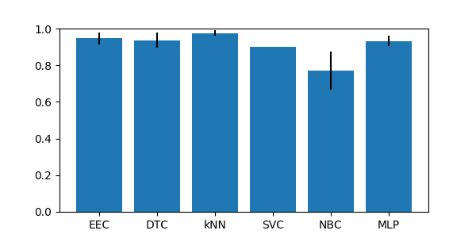

### ecoli-0-3-4-7_vs_5-6 dataset

Best parameters
{'a_steps': 2, 'focus': 5}

|CLF|ACC|STD|
|---|---|---|
| SEE | 0.91 | +-0.04|
| OEE | 0.95 | +-0.01|
| DTC | 0.94 | +-0.02|
| kNN | 0.97 | +-0.03|
| SVC | 0.90 | +-0.00|
| NBC | 0.76 | +-0.10|

### ecoli-0-3-4_vs_5 dataset

Best parameters
{'a_steps': 5, 'focus': 5}

|CLF|ACC|STD|
|---|---|---|
| SEE | 0.97 | +-0.02|
| OEE | 0.96 | +-0.03|
| DTC | 0.93 | +-0.03|
| kNN | 0.97 | +-0.02|
| SVC | 0.90 | +-0.00|
| NBC | 0.75 | +-0.15|

### ecoli-0-4-6_vs_5 dataset

Best parameters
{'a_steps': 1, 'focus': 4}

|CLF|ACC|STD|
|---|---|---|
| SEE | 0.97 | +-0.02|
| OEE | 0.98 | +-0.02|
| DTC | 0.95 | +-0.02|
| kNN | 0.98 | +-0.02|
| SVC | 0.90 | +-0.00|
| NBC | 0.90 | +-0.12|

### ecoli-0-6-7_vs_3-5 dataset

Best parameters
{'a_steps': 0, 'focus': 5}

|CLF|ACC|STD|
|---|---|---|
| SEE | 0.93 | +-0.02|
| OEE | 0.95 | +-0.04|
| DTC | 0.96 | +-0.04|
| kNN | 0.96 | +-0.04|
| SVC | 0.90 | +-0.01|
| NBC | 0.88 | +-0.01|

### ecoli-0-6-7_vs_5 dataset

Best parameters
{'a_steps': 0, 'focus': 4}

|CLF|ACC|STD|
|---|---|---|
| SEE | 0.96 | +-0.02|
| OEE | 0.96 | +-0.03|
| DTC | 0.95 | +-0.03|
| kNN | 0.97 | +-0.01|
| SVC | 0.91 | +-0.00|
| NBC | 0.89 | +-0.09|

### glass-0-1-4-6_vs_2 dataset

Best parameters
{'a_steps': 1, 'focus': 0}

|CLF|ACC|STD|
|---|---|---|
| SEE | 0.70 | +-0.15|
| OEE | 0.81 | +-0.07|
| DTC | 0.89 | +-0.03|
| kNN | 0.90 | +-0.02|
| SVC | 0.92 | +-0.01|
| NBC | 0.43 | +-0.05|

### glass-0-1-5_vs_2 dataset

Best parameters
{'a_steps': 0, 'focus': 0}

|CLF|ACC|STD|
|---|---|---|
| SEE | 0.65 | +-0.04|
| OEE | 0.81 | +-0.06|
| DTC | 0.84 | +-0.06|
| kNN | 0.90 | +-0.03|
| SVC | 0.90 | +-0.01|
| NBC | 0.45 | +-0.16|

### glass-0-4_vs_5 dataset

Best parameters
{'a_steps': 0, 'focus': 4}

|CLF|ACC|STD|
|---|---|---|
| SEE | 0.86 | +-0.09|
| OEE | 0.92 | +-0.04|
| DTC | 0.99 | +-0.02|
| kNN | 0.97 | +-0.03|
| SVC | 0.92 | +-0.03|
| NBC | 0.99 | +-0.02|

### glass-0-6_vs_5 dataset

Best parameters
{'a_steps': 0, 'focus': 5}

|CLF|ACC|STD|
|---|---|---|
| SEE | 0.97 | +-0.02|
| OEE | 0.93 | +-0.02|
| DTC | 0.97 | +-0.02|
| kNN | 0.95 | +-0.03|
| SVC | 0.94 | +-0.02|
| NBC | 0.98 | +-0.02|

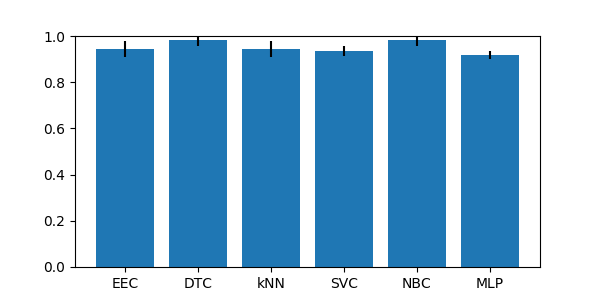

### led7digit-0-2-4-5-6-7-8-9_vs_1 dataset

Best parameters
{'a_steps': 0, 'focus': 0}

|CLF|ACC|STD|
|---|---|---|
| SEE | 0.84 | +-0.05|
| OEE | 0.87 | +-0.05|
| DTC | 0.96 | +-0.02|
| kNN | 0.93 | +-0.02|
| SVC | 0.97 | +-0.02|
| NBC | 0.88 | +-0.06|

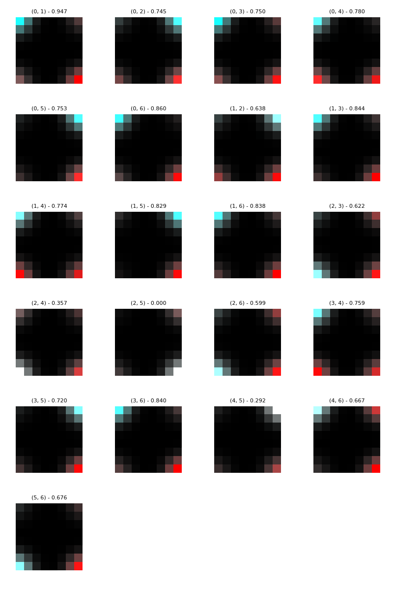

### yeast-0-2-5-6_vs_3-7-8-9 dataset

Best parameters
{'a_steps': 5, 'focus': 5}

|CLF|ACC|STD|
|---|---|---|
| SEE | 0.72 | +-0.05|
| OEE | 0.85 | +-0.03|
| DTC | 0.89 | +-0.01|
| kNN | 0.94 | +-0.02|
| SVC | 0.90 | +-0.00|
| NBC | 0.92 | +-0.02|

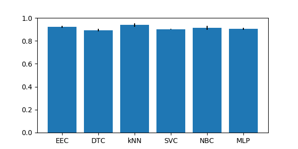

### yeast-0-2-5-7-9_vs_3-6-8 dataset

Best parameters
{'a_steps': 5, 'focus': 5}

|CLF|ACC|STD|
|---|---|---|
| SEE | 0.85 | +-0.03|
| OEE | 0.91 | +-0.02|
| DTC | 0.94 | +-0.01|
| kNN | 0.97 | +-0.00|
| SVC | 0.90 | +-0.00|
| NBC | 0.25 | +-0.05|

### yeast-0-3-5-9_vs_7-8 dataset

Best parameters
{'a_steps': 0, 'focus': 0}

|CLF|ACC|STD|
|---|---|---|
| SEE | 0.78 | +-0.06|
| OEE | 0.82 | +-0.03|
| DTC | 0.87 | +-0.03|
| kNN | 0.91 | +-0.01|
| SVC | 0.91 | +-0.00|
| NBC | 0.20 | +-0.01|

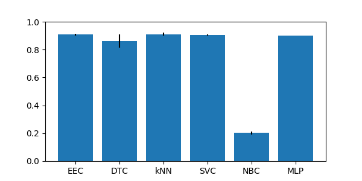

## Group imb_IRlowerThan9

### ecoli-0_vs_1 dataset

Best parameters
{'a_steps': 1, 'focus': 1}

|CLF|ACC|STD|
|---|---|---|
| SEE | 0.99 | +-0.02|
| OEE | 0.97 | +-0.03|
| DTC | 0.96 | +-0.03|
| kNN | 0.99 | +-0.02|
| SVC | 0.96 | +-0.02|
| NBC | 0.95 | +-0.02|

### ecoli1 dataset

Best parameters
{'a_steps': 2, 'focus': 2}

|CLF|ACC|STD|
|---|---|---|
| SEE | 0.87 | +-0.04|
| OEE | 0.87 | +-0.04|
| DTC | 0.88 | +-0.03|
| kNN | 0.93 | +-0.02|
| SVC | 0.86 | +-0.04|
| NBC | 0.65 | +-0.15|

### ecoli2 dataset

Best parameters
{'a_steps': 1, 'focus': 5}

|CLF|ACC|STD|
|---|---|---|
| SEE | 0.91 | +-0.05|
| OEE | 0.89 | +-0.05|
| DTC | 0.91 | +-0.02|
| kNN | 0.97 | +-0.02|
| SVC | 0.85 | +-0.01|
| NBC | 0.35 | +-0.11|

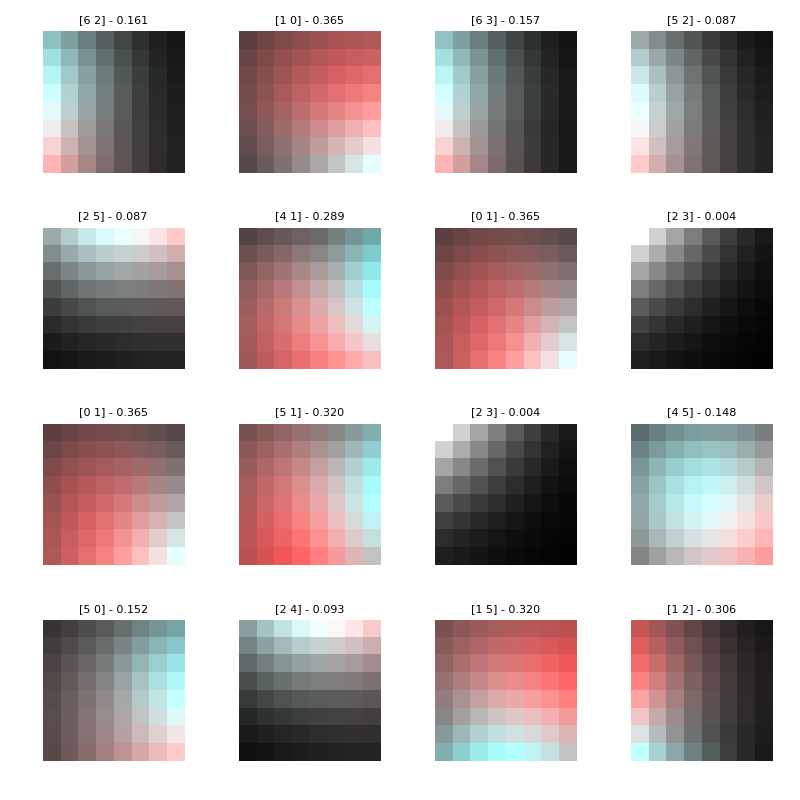

### ecoli3 dataset

Best parameters
{'a_steps': 4, 'focus': 5}

|CLF|ACC|STD|
|---|---|---|
| SEE | 0.83 | +-0.03|
| OEE | 0.91 | +-0.03|
| DTC | 0.89 | +-0.03|
| kNN | 0.93 | +-0.02|
| SVC | 0.90 | +-0.00|
| NBC | 0.77 | +-0.05|

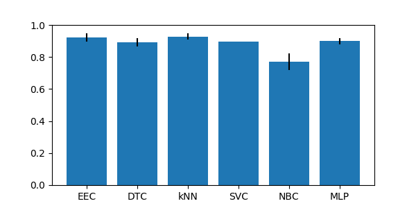

### glass-0-1-2-3_vs_4-5-6 dataset

Best parameters
{'a_steps': 4, 'focus': 0}

|CLF|ACC|STD|
|---|---|---|
| SEE | 0.90 | +-0.04|
| OEE | 0.91 | +-0.04|
| DTC | 0.93 | +-0.03|
| kNN | 0.92 | +-0.02|
| SVC | 0.94 | +-0.03|
| NBC | 0.90 | +-0.05|

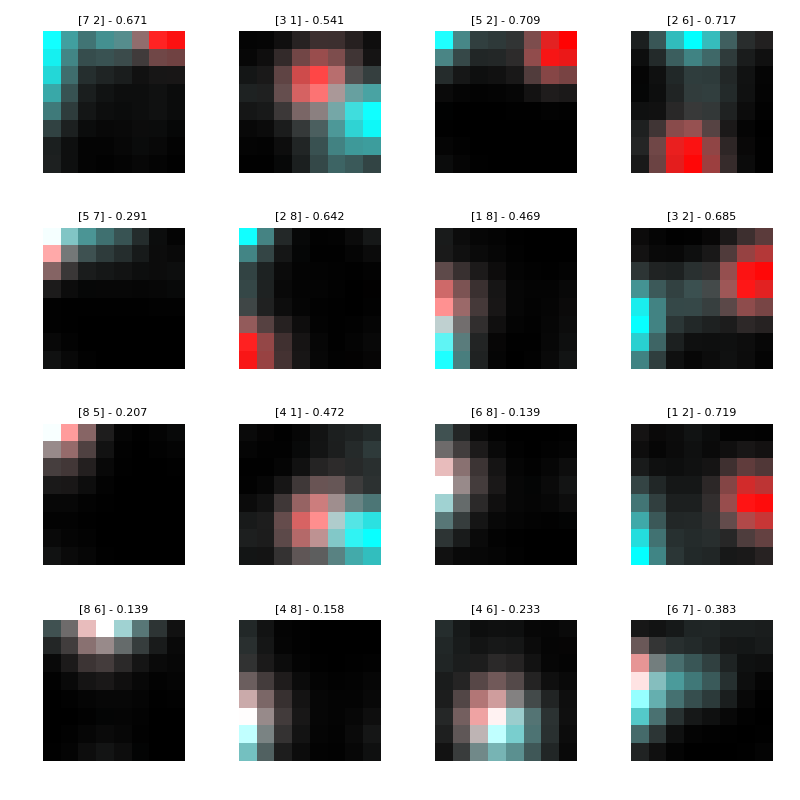

### glass0 dataset

Best parameters
{'a_steps': 0, 'focus': 0}

|CLF|ACC|STD|
|---|---|---|
| SEE | 0.64 | +-0.04|
| OEE | 0.79 | +-0.06|
| DTC | 0.78 | +-0.05|
| kNN | 0.76 | +-0.09|
| SVC | 0.74 | +-0.04|
| NBC | 0.63 | +-0.02|

### glass1 dataset

Best parameters
{'a_steps': 0, 'focus': 0}

|CLF|ACC|STD|
|---|---|---|
| SEE | 0.61 | +-0.04|
| OEE | 0.76 | +-0.05|
| DTC | 0.74 | +-0.05|
| kNN | 0.79 | +-0.08|
| SVC | 0.77 | +-0.04|
| NBC | 0.60 | +-0.03|

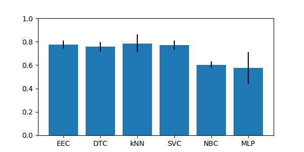

### glass6 dataset

Best parameters
{'a_steps': 0, 'focus': 4}

|CLF|ACC|STD|
|---|---|---|
| SEE | 0.91 | +-0.06|
| OEE | 0.90 | +-0.04|
| DTC | 0.92 | +-0.02|
| kNN | 0.95 | +-0.02|
| SVC | 0.96 | +-0.02|
| NBC | 0.94 | +-0.04|

### iris0 dataset

Best parameters
{'a_steps': 0, 'focus': 0}

|CLF|ACC|STD|
|---|---|---|
| SEE | 1.00 | +-0.00|
| OEE | 1.00 | +-0.00|
| DTC | 1.00 | +-0.00|
| kNN | 1.00 | +-0.00|
| SVC | 1.00 | +-0.00|
| NBC | 1.00 | +-0.00|

### new-thyroid1 dataset

Best parameters
{'a_steps': 0, 'focus': 2}

|CLF|ACC|STD|
|---|---|---|
| SEE | 0.97 | +-0.03|
| OEE | 0.99 | +-0.02|
| DTC | 0.96 | +-0.03|
| kNN | 0.95 | +-0.03|
| SVC | 0.89 | +-0.02|
| NBC | 0.97 | +-0.03|

### new-thyroid2 dataset

Best parameters
{'a_steps': 3, 'focus': 3}

|CLF|ACC|STD|
|---|---|---|
| SEE | 0.99 | +-0.02|
| OEE | 0.98 | +-0.02|
| DTC | 0.95 | +-0.03|
| kNN | 0.95 | +-0.01|
| SVC | 0.88 | +-0.02|
| NBC | 0.98 | +-0.02|

### pima dataset

Best parameters
{'a_steps': 5, 'focus': 5}

|CLF|ACC|STD|
|---|---|---|
| SEE | 0.71 | +-0.03|
| OEE | 0.75 | +-0.03|
| DTC | 0.71 | +-0.02|
| kNN | 0.72 | +-0.03|
| SVC | 0.65 | +-0.00|
| NBC | 0.76 | +-0.01|

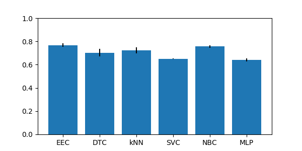

### wisconsin dataset

Best parameters
{'a_steps': 1, 'focus': 3}

|CLF|ACC|STD|
|---|---|---|
| SEE | 0.96 | +-0.01|
| OEE | 0.98 | +-0.00|
| DTC | 0.94 | +-0.02|
| kNN | 0.97 | +-0.01|
| SVC | 0.96 | +-0.01|
| NBC | 0.96 | +-0.01|

### yeast1 dataset

Best parameters
{'a_steps': 0, 'focus': 2}

|CLF|ACC|STD|
|---|---|---|
| SEE | 0.65 | +-0.03|
| OEE | 0.69 | +-0.05|
| DTC | 0.72 | +-0.02|
| kNN | 0.74 | +-0.02|
| SVC | 0.72 | +-0.01|
| NBC | 0.32 | +-0.01|

### yeast3 dataset

Best parameters
{'a_steps': 5, 'focus': 5}

|CLF|ACC|STD|
|---|---|---|
| SEE | 0.90 | +-0.02|
| OEE | 0.92 | +-0.02|
| DTC | 0.93 | +-0.01|
| kNN | 0.95 | +-0.01|
| SVC | 0.89 | +-0.00|
| NBC | 0.31 | +-0.07|

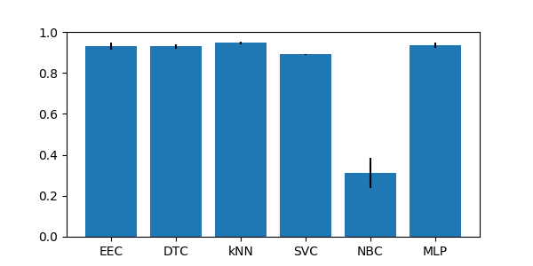

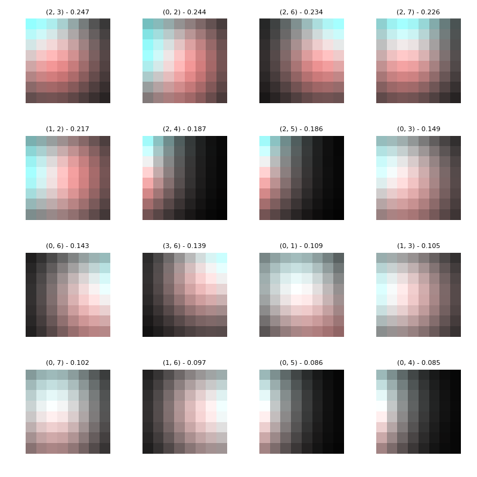
## Group imb_multiclass

### balance dataset

Best parameters
{'a_steps': 0, 'focus': 4}

|CLF|ACC|STD|
|---|---|---|
| SEE | 0.67 | +-0.06|
| OEE | 0.65 | +-0.05|
| DTC | 0.77 | +-0.02|
| kNN | 0.83 | +-0.03|
| SVC | 0.90 | +-0.01|
| NBC | 0.89 | +-0.01|

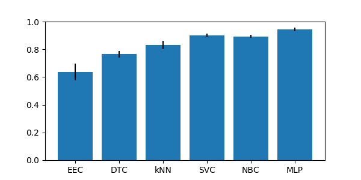

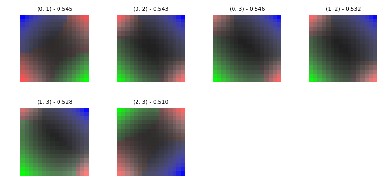

### contraceptive dataset

Best parameters
{'a_steps': 4, 'focus': 0}

|CLF|ACC|STD|
|---|---|---|
| SEE | 0.52 | +-0.03|
| OEE | 0.53 | +-0.02|
| DTC | 0.49 | +-0.02|
| kNN | 0.52 | +-0.02|
| SVC | 0.57 | +-0.01|
| NBC | 0.47 | +-0.03|

### ecoli dataset

Best parameters
{'a_steps': 2, 'focus': 3}

|CLF|ACC|STD|
|---|---|---|
| SEE | 0.81 | +-0.03|
| OEE | 0.82 | +-0.03|
| DTC | 0.75 | +-0.05|
| kNN | 0.82 | +-0.03|
| SVC | 0.43 | +-0.01|
| NBC | 0.60 | +-0.05|

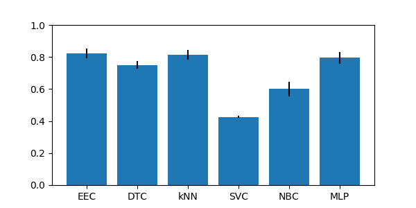

### glass dataset

Best parameters
{'a_steps': 2, 'focus': 0}

|CLF|ACC|STD|
|---|---|---|
| SEE | 0.47 | +-0.04|
| OEE | 0.61 | +-0.03|
| DTC | 0.68 | +-0.06|
| kNN | 0.65 | +-0.04|
| SVC | 0.67 | +-0.03|
| NBC | 0.43 | +-0.08|

### hayes-roth dataset

Best parameters
{'a_steps': 2, 'focus': 0}

|CLF|ACC|STD|
|---|---|---|
| SEE | 0.65 | +-0.09|
| OEE | 0.80 | +-0.03|
| DTC | 0.84 | +-0.06|
| kNN | 0.64 | +-0.05|
| SVC | 0.85 | +-0.06|
| NBC | 0.72 | +-0.07|

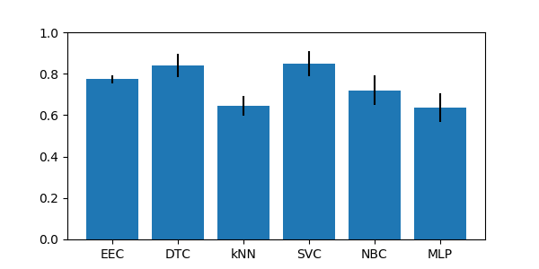

### new-thyroid dataset

Best parameters
{'a_steps': 2, 'focus': 3}

|CLF|ACC|STD|
|---|---|---|
| SEE | 0.96 | +-0.04|
| OEE | 0.94 | +-0.02|
| DTC | 0.93 | +-0.04|
| kNN | 0.93 | +-0.02|
| SVC | 0.75 | +-0.03|
| NBC | 0.96 | +-0.01|

### pageblocks dataset

Best parameters
{'a_steps': 0, 'focus': 5}

|CLF|ACC|STD|
|---|---|---|
| SEE | 0.72 | +-0.06|
| OEE | 0.81 | +-0.09|
| DTC | 0.95 | +-0.02|
| kNN | 0.94 | +-0.01|
| SVC | 0.90 | +-0.01|
| NBC | 0.92 | +-0.02|

### shuttle dataset

Best parameters
{'a_steps': 0, 'focus': 0}

|CLF|ACC|STD|
|---|---|---|
| SEE | 0.75 | +-0.04|
| OEE | 0.88 | +-0.05|
| DTC | 1.00 | +-0.00|
| kNN | 0.99 | +-0.00|
| SVC | 0.83 | +-0.01|
| NBC | 0.90 | +-0.02|

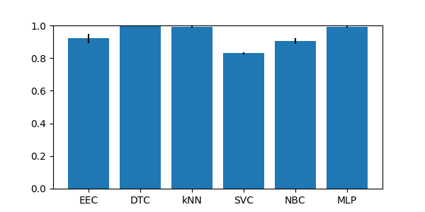

### thyroid dataset

Best parameters
{'a_steps': 5, 'focus': 5}

|CLF|ACC|STD|
|---|---|---|
| SEE | 0.55 | +-0.08|
| OEE | 0.86 | +-0.05|
| DTC | 0.98 | +-0.01|
| kNN | 0.93 | +-0.00|
| SVC | 0.93 | +-0.00|
| NBC | 0.17 | +-0.04|

### wine dataset

Best parameters
{'a_steps': 0, 'focus': 3}

|CLF|ACC|STD|
|---|---|---|
| SEE | 0.94 | +-0.05|
| OEE | 0.97 | +-0.03|
| DTC | 0.93 | +-0.03|
| kNN | 0.69 | +-0.05|
| SVC | 0.44 | +-0.03|
| NBC | 0.98 | +-0.02|

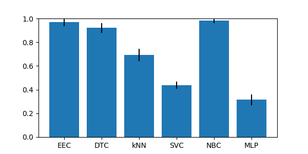

### yeast dataset

Best parameters
{'a_steps': 5, 'focus': 5}

|CLF|ACC|STD|
|---|---|---|
| SEE | 0.37 | +-0.01|
| OEE | 0.47 | +-0.03|
| DTC | 0.49 | +-0.01|
| kNN | 0.56 | +-0.01|
| SVC | 0.42 | +-0.01|
| NBC | 0.15 | +-0.03|

