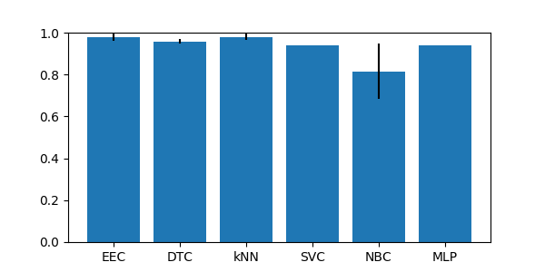
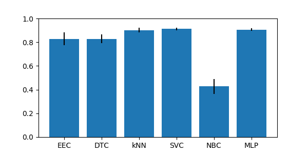
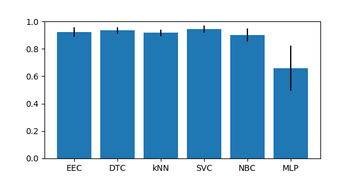
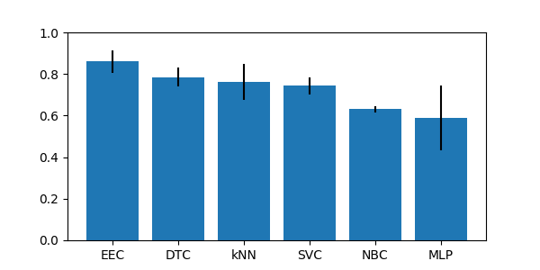
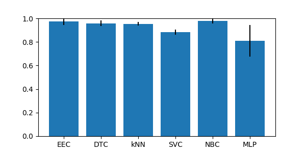
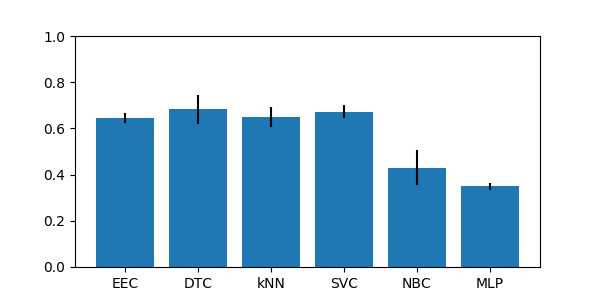
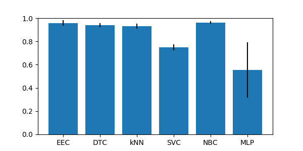

## Group imb_IRhigherThan9p1

### ecoli-0-1-3-7_vs_2-6 dataset

|CLF|ACC|STD|
|---|---|---|
|  EE | 0.98 | +-0.02|
| DTC | 0.96 | +-0.02|
| kNN | 0.99 | +-0.01|
| SVC | 0.98 | +-0.01|
| NBC | 0.94 | +-0.03|

### ecoli4 dataset

|CLF|ACC|STD|
|---|---|---|
|  EE | 0.93 | +-0.03|
| DTC | 0.96 | +-0.01|
| kNN | 0.98 | +-0.02|
| SVC | 0.94 | +-0.00|
| NBC | 0.82 | +-0.13|

### glass-0-1-6_vs_2 dataset

|CLF|ACC|STD|
|---|---|---|
|  EE | 0.74 | +-0.06|
| DTC | 0.85 | +-0.03|
| kNN | 0.90 | +-0.02|
| SVC | 0.91 | +-0.01|
| NBC | 0.43 | +-0.06|

## Group imb_IRlowerThan9

### ecoli-0_vs_1 dataset

|CLF|ACC|STD|
|---|---|---|
|  EE | 0.97 | +-0.02|
| DTC | 0.97 | +-0.02|
| kNN | 0.99 | +-0.02|
| SVC | 0.96 | +-0.02|
| NBC | 0.95 | +-0.02|

### ecoli1 dataset

|CLF|ACC|STD|
|---|---|---|
|  EE | 0.87 | +-0.03|
| DTC | 0.88 | +-0.03|
| kNN | 0.93 | +-0.02|
| SVC | 0.86 | +-0.04|
| NBC | 0.65 | +-0.15|

### ecoli2 dataset

|CLF|ACC|STD|
|---|---|---|
|  EE | 0.90 | +-0.05|
| DTC | 0.91 | +-0.01|
| kNN | 0.97 | +-0.02|
| SVC | 0.85 | +-0.01|
| NBC | 0.35 | +-0.11|

### ecoli3 dataset

|CLF|ACC|STD|
|---|---|---|
|  EE | 0.85 | +-0.03|
| DTC | 0.90 | +-0.02|
| kNN | 0.93 | +-0.02|
| SVC | 0.90 | +-0.00|
| NBC | 0.77 | +-0.05|

### glass-0-1-2-3_vs_4-5-6 dataset

|CLF|ACC|STD|
|---|---|---|
|  EE | 0.91 | +-0.03|
| DTC | 0.93 | +-0.03|
| kNN | 0.92 | +-0.02|
| SVC | 0.94 | +-0.03|
| NBC | 0.90 | +-0.05|

### glass0 dataset

|CLF|ACC|STD|
|---|---|---|
|  EE | 0.79 | +-0.02|
| DTC | 0.80 | +-0.05|
| kNN | 0.76 | +-0.09|
| SVC | 0.74 | +-0.04|
| NBC | 0.63 | +-0.02|

### glass1 dataset

|CLF|ACC|STD|
|---|---|---|
|  EE | 0.76 | +-0.04|
| DTC | 0.75 | +-0.06|
| kNN | 0.79 | +-0.08|
| SVC | 0.77 | +-0.04|
| NBC | 0.60 | +-0.03|

### glass6 dataset

|CLF|ACC|STD|
|---|---|---|
|  EE | 0.95 | +-0.02|
| DTC | 0.92 | +-0.02|
| kNN | 0.95 | +-0.02|
| SVC | 0.96 | +-0.02|
| NBC | 0.94 | +-0.04|

### iris0 dataset

|CLF|ACC|STD|
|---|---|---|
|  EE | 1.00 | +-0.00|
| DTC | 1.00 | +-0.00|
| kNN | 1.00 | +-0.00|
| SVC | 1.00 | +-0.00|
| NBC | 1.00 | +-0.00|

### new-thyroid1 dataset

|CLF|ACC|STD|
|---|---|---|
|  EE | 0.97 | +-0.03|
| DTC | 0.97 | +-0.02|
| kNN | 0.95 | +-0.03|
| SVC | 0.89 | +-0.02|
| NBC | 0.97 | +-0.03|

### new-thyroid2 dataset

|CLF|ACC|STD|
|---|---|---|
|  EE | 0.98 | +-0.02|
| DTC | 0.96 | +-0.02|
| kNN | 0.95 | +-0.01|
| SVC | 0.88 | +-0.02|
| NBC | 0.98 | +-0.02|

### pima dataset

|CLF|ACC|STD|
|---|---|---|
|  EE | 0.67 | +-0.03|
| DTC | 0.71 | +-0.02|
| kNN | 0.72 | +-0.03|
| SVC | 0.65 | +-0.00|
| NBC | 0.76 | +-0.01|

### wisconsin dataset

|CLF|ACC|STD|
|---|---|---|
|  EE | 0.96 | +-0.01|
| DTC | 0.94 | +-0.02|
| kNN | 0.97 | +-0.01|
| SVC | 0.96 | +-0.01|
| NBC | 0.96 | +-0.01|

### yeast1 dataset

|CLF|ACC|STD|
|---|---|---|
|  EE | 0.55 | +-0.03|
| DTC | 0.72 | +-0.03|
| kNN | 0.74 | +-0.02|
| SVC | 0.72 | +-0.01|
| NBC | 0.32 | +-0.01|

### yeast3 dataset

|CLF|ACC|STD|
|---|---|---|
|  EE | 0.88 | +-0.01|
| DTC | 0.93 | +-0.01|
| kNN | 0.95 | +-0.01|
| SVC | 0.89 | +-0.00|
| NBC | 0.31 | +-0.07|

## Group imb_multiclass

### balance dataset

|CLF|ACC|STD|
|---|---|---|
|  EE | 0.68 | +-0.04|
| DTC | 0.76 | +-0.02|
| kNN | 0.83 | +-0.03|
| SVC | 0.90 | +-0.01|
| NBC | 0.89 | +-0.01|

### contraceptive dataset

|CLF|ACC|STD|
|---|---|---|
|  EE | 0.53 | +-0.02|
| DTC | 0.48 | +-0.03|
| kNN | 0.52 | +-0.02|
| SVC | 0.57 | +-0.01|
| NBC | 0.47 | +-0.03|

### ecoli dataset

|CLF|ACC|STD|
|---|---|---|
|  EE | 0.82 | +-0.05|
| DTC | 0.75 | +-0.01|
| kNN | 0.82 | +-0.03|
| SVC | 0.43 | +-0.01|
| NBC | 0.60 | +-0.05|

### glass dataset

|CLF|ACC|STD|
|---|---|---|
|  EE | 0.62 | +-0.04|
| DTC | 0.68 | +-0.04|
| kNN | 0.65 | +-0.04|
| SVC | 0.67 | +-0.03|
| NBC | 0.43 | +-0.08|

### hayes-roth dataset

|CLF|ACC|STD|
|---|---|---|
|  EE | 0.77 | +-0.06|
| DTC | 0.84 | +-0.06|
| kNN | 0.64 | +-0.05|
| SVC | 0.85 | +-0.06|
| NBC | 0.72 | +-0.07|

### new-thyroid dataset

|CLF|ACC|STD|
|---|---|---|
|  EE | 0.97 | +-0.03|
| DTC | 0.93 | +-0.04|
| kNN | 0.93 | +-0.02|
| SVC | 0.75 | +-0.03|
| NBC | 0.96 | +-0.01|

### yeast dataset

|CLF|ACC|STD|
|---|---|---|
|  EE | 0.37 | +-0.04|
| DTC | 0.48 | +-0.01|
| kNN | 0.56 | +-0.01|
| SVC | 0.42 | +-0.01|
| NBC | 0.15 | +-0.03|

